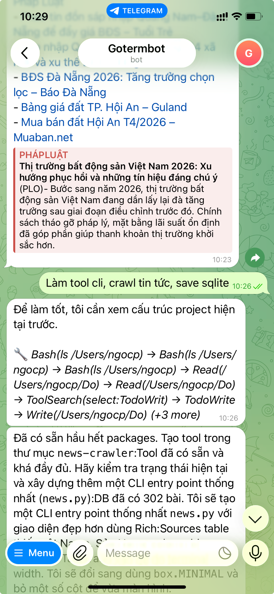
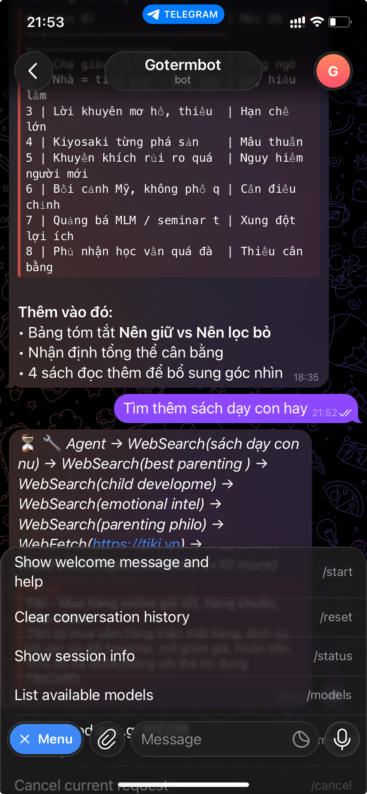

# BomClaw

Lean AI agent that gives Claude full control over your computer. One binary, one process, no microservices.

BomClaw turns any machine — Linux, macOS, or Windows (via WSL) — into an
AI-controlled workstation you can command from Telegram or a local CLI.
It runs an agentic loop: the model calls tools, sees results, and keeps going
until the task is done. Think of it as a personal, self-hosted Claude Code
that you talk to from anywhere.

**Philosophy:**
- Full computer control — shell, files, processes, clipboard, browser, screenshots
- Cross-platform — runs wherever Go compiles (Linux, macOS, Windows/WSL)
- Small enough to understand (~65 source files, 18 packages)
- Built for one user — bespoke, not a framework
- Customization = code changes, not config sprawl

<p align="center">
  
  &nbsp;&nbsp;
  
  <br/>
  <em>Left: tool calls, web crawling, and structured output &nbsp;|&nbsp; Right: interactive chat with book recommendations</em>
</p>

## Quick Start

```bash
# Clone
git clone https://github.com/phanngoc/goterm-control.git
cd goterm-control

# Authenticate with Claude CLI (uses your Pro/Max subscription)
claude login

# Set up credentials
cp .env.example .env
# Edit .env: add TELEGRAM_TOKEN (optional, for Telegram access)

# Build
go build -o bomclaw ./cmd/bomclaw/

# Interactive chat (no Telegram needed)
./bomclaw chat

# Or start the gateway (Telegram + Web Dashboard + WebSocket RPC)
./bomclaw gateway
```

### Prerequisites

- Go 1.22+
- [Claude CLI](https://docs.anthropic.com/en/docs/claude-code) installed and logged in (`claude login`)
  - Uses your Claude Pro/Max subscription via OAuth2 — no API key needed
  - Or alternatively, set `ANTHROPIC_API_KEY` for direct API access
- For Telegram: a bot token from [@BotFather](https://t.me/BotFather)

### Authentication

BomClaw supports two authentication modes, auto-detected at startup:

| Mode | Token prefix | How it works |
|---|---|---|
| **Claude CLI (recommended)** | `sk-ant-oat...` | Uses `claude` CLI subprocess with your Pro/Max subscription. No per-token billing. |
| **Direct API** | `sk-ant-api03...` | Calls Anthropic Messages API directly. Pay-per-use. |

Run `claude login` and BomClaw picks up the OAuth token automatically.
To use a direct API key instead, set `ANTHROPIC_API_KEY` in `.env`.

### Environment Variables

| Variable | Required | Description |
|---|---|---|
| `ANTHROPIC_API_KEY` | No | Anthropic API key (only if not using Claude CLI OAuth) |
| `TELEGRAM_TOKEN` | For Telegram | Telegram bot token |

## Commands

```
bomclaw gateway     Start gateway (Telegram bot + WebSocket RPC server)
bomclaw chat        Interactive CLI chat (direct API, no gateway needed)
bomclaw send        Send a message via the gateway
bomclaw status      Show gateway status
bomclaw models      List available models
```

### Examples

```bash
# Chat with Claude directly
./bomclaw chat
./bomclaw chat --model opus

# Start the gateway on a custom port
./bomclaw gateway --port 9000 --bind 0.0.0.0

# Send a message to the running gateway
./bomclaw send "list all running docker containers"
./bomclaw send --model haiku "what time is it"

# Check gateway health
./bomclaw status
```

### Telegram Commands

Once the gateway is running with a Telegram token:

| Command | Description |
|---|---|
| `/start` | Show welcome and help |
| `/models` | List available models with pricing |
| `/model <name>` | Switch model (e.g. `/model opus`, `/model haiku`) |
| `/model default` | Reset to default model |
| `/status` | Show session info, token usage, queue depth |
| `/reset` | Clear conversation history |
| `/cancel` | Cancel in-flight request |

## Architecture

```
┌───────────┐  ┌──────────────┐  ┌───────────────┐
│  Telegram │  │ Web Dashboard│  │   CLI Chat    │
│  Bot      │  │  (React SPA) │  │  (bomclaw    │
└─────┬─────┘  └──────┬───────┘  │   chat)       │
      │               │          └───────┬───────┘
      │          WebSocket               │
      │               │            direct call
      ▼               ▼                  ▼
┌─────────────────────────────────────────────────┐
│              Gateway (JSON-RPC)                  │
│         session mgmt · model resolver            │
└──────────────────────┬──────────────────────────┘
                       │
                       ▼
              ┌─────────────────┐
              │   Agent Loop    │  ← up to 50 iterations
              │  (stream + tool │     per request
              │   call cycle)   │
              └────────┬────────┘
                       │
          ┌────────────┼────────────┐
          ▼            │            ▼
┌──────────────┐       │    ┌──────────────┐
│  Claude CLI  │       │    │  Anthropic   │
│  (OAuth2     │       │    │  Direct API  │
│  subscription│       │    │  (sk-ant-api)│
│  sk-ant-oat) │       │    └──────────────┘
└──────────────┘       │
                       ▼
        ┌──────────────────────────────┐
        │        Tool Executor         │
        ├──────────────┬───────────────┤
        │ System Tools │ Browser Tools │
        │ · run_shell  │ · navigate    │
        │ · read/write │ · click/fill  │
        │ · screenshot │ · snapshot    │
        │ · clipboard  │ · eval JS     │
        │ · processes  │ · screenshot  │
        │ · sysinfo    │ · scroll/wait │
        └──────────────┴───────────────┘
                       │
        ┌──────────────┼──────────────┐
        ▼              ▼              ▼
   ┌─────────┐  ┌───────────┐  ┌──────────┐
   │ Context │  │  Memory   │  │Transcript│
   │ Engine  │  │  (JSONL)  │  │  (JSONL) │
   └─────────┘  └───────────┘  └──────────┘
```

### The Agent Loop (the core)

The heart of BomClaw is in `internal/agent/loop.go`. It runs:

```
user message
  → assemble context (under token budget)
  → stream model response
  → if model calls tools:
      → execute tools
      → feed results back to model
      → loop again
  → if model says "end_turn":
      → return response
  → if context overflow:
      → compact (summarize old messages)
      → retry
  → if rate limited:
      → exponential backoff → retry
```

This loop runs up to 50 iterations per request. The model can chain multiple
tool calls, read results, and keep working until the task is done.

### Packages

| Package | Purpose |
|---|---|
| `agent/` | Core agentic loop with retry and tool execution |
| `anthropic/` | Direct Anthropic Messages API client (streaming) |
| `claude/` | Claude CLI subprocess provider (OAuth2 subscription) |
| `browser/` | Chrome DevTools Protocol (CDP) client for browser automation |
| `bot/` | Telegram bot with streaming message edits |
| `channel/` | Channel abstraction (Telegram, CLI) |
| `config/` | YAML config with env var overrides |
| `context/` | Token counting, budget assembly, compaction |
| `execution/` | Per-session FIFO queue (prevents concurrent calls) |
| `gateway/` | WebSocket JSON-RPC server + static file serving (dashboard) |
| `memory/` | Cross-session keyword memory |
| `models/` | Model catalog with aliases and per-session override |
| `session/` | Persistent session management |
| `tools/` | System control tools (shell, files, screenshot, browser, ...) |
| `transcript/` | JSONL event recording per session |

### Tools

The agent has 25 tools for full computer control:

**System tools:**

| Tool | What it does |
|---|---|
| `run_shell` | Execute any bash command |
| `read_file` | Read file contents |
| `write_file` | Write/append to files |
| `list_dir` | List directory (recursive, hidden files) |
| `search_files` | Search by filename or content (regex) |
| `take_screenshot` | Capture screen |
| `get_clipboard` | Read clipboard |
| `set_clipboard` | Write to clipboard |
| `run_applescript` | Control apps via AppleScript (macOS) |
| `open_app` | Open applications or files (`open`/`xdg-open`) |
| `get_system_info` | Hardware, OS, CPU, memory, disk |
| `list_processes` | Running processes with filter/sort |
| `kill_process` | Kill by PID or name (TERM/KILL) |
| `browse_url` | Fetch URL content or open in browser |

**Browser automation tools (Chrome DevTools Protocol):**

| Tool | What it does |
|---|---|
| `browser_navigate` | Navigate to a URL (auto-launches Chrome) |
| `browser_snapshot` | DOM snapshot with interactive element refs |
| `browser_click` | Click an element by ref |
| `browser_fill` | Clear and type into an input field |
| `browser_type` | Append text to an input field |
| `browser_select` | Select a dropdown option |
| `browser_scroll` | Scroll page in any direction |
| `browser_screenshot` | Screenshot the current page |
| `browser_get_text` | Get text, HTML, value, or URL from elements |
| `browser_eval` | Execute JavaScript in the browser |
| `browser_wait` | Wait for element, text, or timeout |

### Data Persistence

All state lives under `~/.goterm/data/`:

```
~/.goterm/data/
  sessions.json           # session metadata (persisted on change, atomic writes)
  transcripts/
    chat_<id>.jsonl       # per-session conversation log (append-only)
  memory/
    memory.jsonl          # cross-session keyword memory
```

### Models

Three built-in Claude models with aliases for quick switching:

| Model | Aliases | Context | Cost (in/out per 1M) |
|---|---|---|---|
| `claude-opus-4-6` | `opus`, `o4` | 200k | $15 / $75 |
| `claude-sonnet-4-6` | `sonnet`, `s4` | 200k | $3 / $15 |
| `claude-haiku-4-5` | `haiku`, `h4` | 200k | $0.80 / $4 |

Add custom models in `config.yaml` under `models.custom`.

## Configuration

Edit `config.yaml`:

```yaml
claude:
  api_key: ""                    # auto-detected from claude CLI OAuth; or set ANTHROPIC_API_KEY
  model: "claude-sonnet-4-6"     # default model
  system_prompt: |
    You are an AI assistant with full control over this computer...

models:
  default: ""                    # override claude.model
  # custom:                      # add custom models
  #   - id: "deepseek-r1"
  #     name: "DeepSeek R1"
  #     ...

session:
  data_dir: ""                   # default: ~/.goterm/data
  idle_timeout: 30               # minutes before auto-reset

memory:
  enabled: true
  max_entries: 5                 # memories injected per prompt

security:
  allowed_user_ids: []           # Telegram user whitelist (empty = allow all)

tools:
  shell_timeout: 60              # seconds
  max_output_bytes: 8192         # truncation limit
```

Minimal config — most fields have sensible defaults. Run `claude login`
and optionally set `TELEGRAM_TOKEN` in `.env` and you're running.

## Development

```bash
# Build
go build ./...

# Run tests (21 tests across 5 packages)
go test ./internal/... -v

# Build the binary
go build -o bomclaw ./cmd/bomclaw/

# Build the Telegram-only bot (legacy entry point)
go build -o goterm ./cmd/goterm/
```

### Project Structure

```
cmd/
  bomclaw/main.go          CLI entry point (gateway, chat, send, status, models)
  goterm/main.go            Legacy Telegram-only entry point

dashboard/                  React web dashboard (Vite + TailwindCSS)

internal/
  agent/                    Core agent loop + types
  anthropic/                Direct Anthropic API client
  bot/                      Telegram bot (handler, streamer)
  browser/                  Chrome DevTools Protocol (CDP) client
  channel/                  Channel interface + CLI implementation
  claude/                   Claude CLI subprocess (OAuth2 provider)
  config/                   YAML config loading
  context/                  Context engine (tokens, assembly, compaction)
  execution/                Per-session FIFO execution queue
  gateway/                  WebSocket JSON-RPC server + dashboard hosting
  memory/                   Cross-session keyword memory
  models/                   Model catalog + resolver
  session/                  Persistent session management
  tools/                    System + browser control tools
  transcript/               JSONL event recording
```

## Security

- The agent runs with `--permission-mode bypassPermissions` — all tool calls
  execute without confirmation. This is intentional for a personal bot.
- Restrict access via `security.allowed_user_ids` in config.
- The gateway binds to `127.0.0.1` by default (localhost only).
- Auth via Claude CLI OAuth2 (subscription) or API keys from `.env` (gitignored).

## Compared to openclaw

BomClaw is inspired by [openclaw](https://github.com/openclaw/openclaw) but
radically simplified:

| | openclaw | BomClaw |
|---|---|---|
| Language | TypeScript | Go |
| Binary | Node.js + many deps | Single static binary (13MB) |
| Source files | 1000+ | 45 |
| Auth | API keys only | Claude CLI OAuth2 or API key |
| Providers | 40+ (plugin system) | Claude (CLI OAuth + direct API) |
| Channels | 20+ (plugin system) | Telegram + Web Dashboard + CLI |
| Memory | LanceDB + embeddings | JSONL + keyword search |
| Config | ~200 config fields | ~15 config fields |
| Context engine | Pluggable with DAG branching | Simple budget-based trimming |
| Target user | Teams, multi-tenant | Individual, single machine |

## License

MIT
