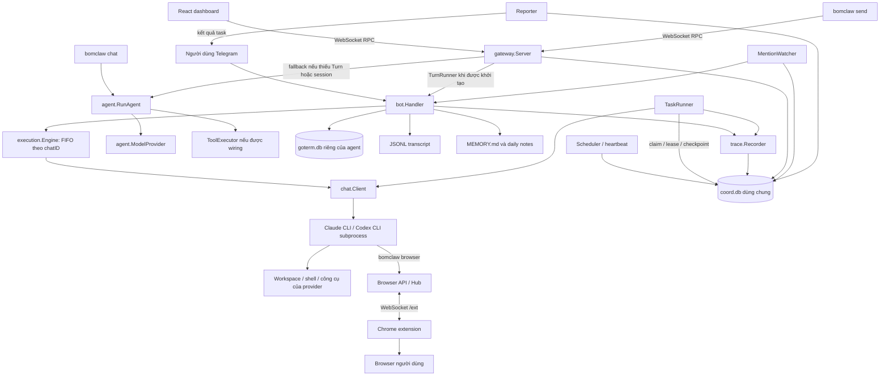
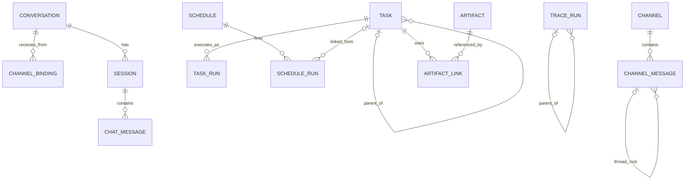
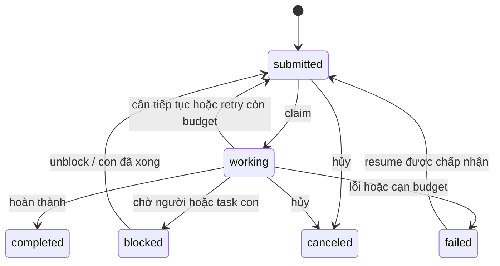
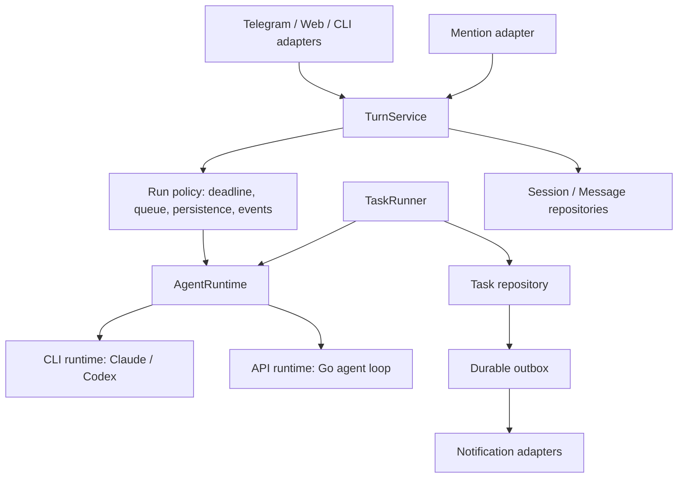

# BomClaw / goterm-control — Giải thích và đánh giá kiến trúc

Ngày đánh giá: 13/09/2026. Mã nguồn đối chiếu: commit `2e50088`.

Phạm vi: kiến trúc thực thi, đối tượng nghiệp vụ, luồng dữ liệu, tính nhất quán, khả năng vận hành và mở rộng. Báo cáo dựa trên code trong repo, không giả định mọi đề xuất trong `docs/design/` đã được triển khai. Không thay đổi code ứng dụng. Các nhận xét lỗi dưới đây là kết quả đọc code, trừ phần kiểm chứng test được ghi riêng.

## 1. Nhận định tổng thể

BomClaw hiện là **một ứng dụng Go chia module, có thể chạy nhiều tiến trình agent trên cùng máy, dùng SQLite chung để điều phối**. Mỗi tiến trình có gateway, provider, workspace và dữ liệu hội thoại riêng; nhiều tiến trình phối hợp qua task, channel, shared notes và trace.

Hệ thống có ba nhóm công việc:

1. **Tương tác:** người dùng chat qua Telegram hoặc dashboard, nhận phản hồi streaming.
2. **Thực thi nền:** task được claim, chạy có thời hạn, checkpoint và tiếp tục qua nhiều lượt.
3. **Điều phối:** scheduler tạo công việc theo lịch; channel mention đánh thức agent; reporter trả kết quả về người yêu cầu.

Dưới góc nhìn architect, lựa chọn Go + SQLite + provider CLI phù hợp với trợ lý cá nhân hoặc một nhóm agent được tin cậy trên cùng máy. Những điểm tốt nhất là mô hình task nhiều run, lease/fencing, pin credential theo session và trace dạng cây. Nợ kiến trúc lớn nhất là engine hội thoại phụ thuộc khởi tạo Telegram, nhiều đường chạy chưa đồng nhất, và giao dịch DB chưa bao trùm được việc gửi thông báo hay thực thi tác động bên ngoài.

**Kết luận sử dụng:** nền tảng hợp lý cho môi trường local có một chủ sở hữu; cần củng cố tính đúng đắn và vòng đời thực thi trước khi tăng mức tự động hóa. Chưa có cơ sở coi đây là nền tảng SaaS nhiều tenant hoặc hệ thống worker phân tán nhiều máy.

## 2. Sơ đồ kiến trúc đang có



Mỗi gateway có thể có runner và scheduler riêng. Tính độc quyền khi claim task hoặc lịch đến từ cập nhật có điều kiện trong `coord.db`, không đến từ một tiến trình master.

Nguồn: [composition root](../cmd/bomclaw/main.go), các hàm `runGateway`, `runChat`, `buildProvider`; [gateway dependencies và routing](../internal/gateway/methods.go).

### Các module và trách nhiệm

| Module | Trách nhiệm thực tế |
|---|---|
| `cmd/bomclaw` | CLI, nạp cấu hình, tạo dependencies, khởi động/dừng gateway và các vòng lặp nền |
| `gateway` | HTTP/WebSocket, RPC, dashboard, admin, browser API, nhận và trả lời mention |
| `bot` | Telegram adapter **và** engine hội thoại dùng chung: memory, stream, trace, transcript, auto-continue |
| `chat` | Hợp đồng `Client`, callback và `TurnSink` giữa provider và tầng hội thoại |
| `execution` | Hàng đợi FIFO theo `chatID`, giới hạn song song trong engine, quản lý subprocess |
| `agent`, `anthropic`, `context`, `tools` | Đường agent loop do Go điều khiển, model streaming, context và tool execution |
| `claude`, `codex`, `credentials` | Adapter CLI, resume session/thread, chọn account và xử lý credential pool |
| `session`, `storage`, `transcript` | Session trong RAM, SQLite riêng và lịch sử JSONL |
| `coord` | DB dùng chung: agents, task, run, channel/thread, notes, schedules, artifact metadata |
| `taskrunner`, `scheduler`, `reporter` | Chạy task, phát lịch, chuyển kết quả về người yêu cầu |
| `memory` | Memory dạng Markdown, tạo context và prompt flush |
| `browserbridge`, `browser` | Hai cách điều khiển browser: extension trên browser người dùng và CDP trực tiếp |
| `auth`, `daemon` | Xác thực dashboard và tích hợp service hệ điều hành |
| `dashboard` | React + Zustand; hiển thị chat, session, task board, trace, channel, schedules |
| `cmd/bomtray` | Tray đọc trạng thái và hỗ trợ vận hành trên desktop |

`cmd/bdscrawler`, `internal/bds`, `stock_debate` là các phần ứng dụng/chuyên biệt trong repo; không nằm trong đường chat chính được phân tích ở đây.

## 3. Các đối tượng: phân biệt đúng để hiểu code

### 3.1. Đối tượng nghiệp vụ và nơi lưu

| Đối tượng | Ý nghĩa | Khóa / quan hệ | Nơi lưu |
|---|---|---|---|
| Agent | Một danh tính worker/gateway, gắn provider và workspace | `agent_id`; heartbeat cho biết còn hoạt động | `coord.db`, cấu hình tiến trình |
| Conversation | Hội thoại logic có thể dùng chung giữa Web và Telegram | `conversation_id`; code session vẫn dùng tên `chat_id` | `goterm.db` |
| ChannelBinding | Ánh xạ một đầu vào sang conversation | `(channel, external_id)` → conversation | `goterm.db` |
| ChatState | Session nào đang active trong conversation | `chat_id`, `active_session_id`, `next_seq` | RAM + `goterm.db` |
| Session | Một mạch ngữ cảnh tương tác có thể resume | `ID`, `ChatID`, provider, account, provider session ID | RAM + `goterm.db` với session chat |
| Provider session/thread | Hội thoại nội bộ của Claude/Codex | `ClaudeSessionID` hiện cũng chứa Codex thread ID | Kho riêng của provider CLI |
| Chat Message | Nội dung user/assistant phục vụ lịch sử hội thoại | `session_id` | Bảng `messages` trong `goterm.db` |
| Transcript Event | Sự kiện user, assistant, partial, tool call/result | `session_id`, timestamp | File JSONL |
| Task | Mục tiêu công việc có vòng đời độc lập với một lần gọi model | `task_id`, `context_id`, `parent_id`, acceptance | `coord.db` |
| TaskRun | Một lần chạy có giới hạn thời gian của task | Task có nhiều run | `coord.db` |
| Trace Run / Span | Một bước đo đạc: turn, model call, tool, task | `trace_id`, `parent_run_id`, `dotted_order` | `coord.db` |
| Schedule / ScheduleRun | Định nghĩa lịch và một lần phát lịch | Lần chạy có thể liên kết tới task | `coord.db` |
| Collaboration Channel | Phòng trao đổi giữa người và agent | Thành viên, tin nhắn, thread, mention | `coord.db` |
| ThreadSession | Provider session được agent dùng để trả lời trong một thread | `(thread_key, agent_id)` | `coord.db` |
| Artifact | Đầu ra công việc có thể tham chiếu từ task khác | Artifact và liên kết tới task/context | Metadata trong DB; nội dung ở filesystem |
| Memory / Note / Scratch | Tri thức dài hạn, ghi chú chung, việc agent cần tự kiểm tra | Scope theo workspace hoặc agent/context | Markdown và `coord.db` tùy loại |
| Account | Credential provider mà session được pin vào | Tên account + provider | Cấu hình; trạng thái chọn/cooldown trong RAM |

Hai ý rất dễ nhầm:

- **Conversation ≠ Session:** một cuộc hội thoại có thể có nhiều session. Đổi session tạo/ngắt một mạch ngữ cảnh, không nhất thiết đổi người hay kênh.
- **Task ≠ Run ≠ Trace:** task là việc cần hoàn thành; run là một lần cố gắng; trace giải thích lần cố gắng đã gọi model và tool như thế nào. `execution.RunResult`, `coord.TaskRun` và `coord.Run` là các kiểu khác nhau.

Ngoài ra, `channel` có hai nghĩa trong repo: transport đầu vào như CLI/Telegram, và phòng cộng tác trong `coord`. Cần nói rõ nghĩa khi thiết kế API mới.

Nguồn: [Session](../internal/session/session.go), [ConversationStore](../internal/storage/conversations.go), [Task và SessionRef](../internal/coord/tasks.go), [TaskRun](../internal/coord/taskruns.go), [Channel và ThreadSession](../internal/coord/channels.go), [Artifact](../internal/coord/artifacts.go).

### 3.2. Quan hệ logic



Đây là quan hệ nghiệp vụ, không khẳng định mọi cạnh đều được enforce bằng foreign key trong schema.

### 3.3. Các abstraction kỹ thuật quan trọng

- `chat.Client.SendMessage(...)`: chạy một turn qua CLI; provider quản lý resume và tool loop của chính nó.
- `agent.ModelProvider.Stream(...)`: stream một lần gọi model cho vòng lặp do Go quản lý.
- `gateway.TurnRunner.RunTurn(...)`: hợp đồng để gateway gọi engine hội thoại. Implementation hiện là `bot.Handler`.
- `chat.TurnSink`: đích xuất text, trạng thái tool, ảnh và finalize. Telegram chỉnh sửa tin nhắn; WebSocket gửi event.
- `execution.Engine`: tuần tự hóa request theo `chatID`. Hai session cùng conversation vẫn chung một lane; tên/comment “per-session” chưa diễn đạt đúng khóa thực tế.

Hai provider interface phục vụ hai mức trừu tượng khác nhau. Vấn đề không phải cứ có hai interface là sai; vấn đề là feature, context, timeout và persistence giữa các đường sử dụng chúng chưa có một hợp đồng thống nhất.

## 4. Data flow chi tiết

### 4.1. Dashboard gửi một tin nhắn

```mermaid
sequenceDiagram
    participant U as Dashboard
    participant G as Gateway
    participant S as SessionManager
    participant H as bot.Handler
    participant Q as Execution Engine
    participant P as Provider CLI
    participant D as DB / JSONL / Trace
    U->>G: send(id, message, session_id?)
    G->>S: Resolve session hoặc active conversation
    G->>H: RunTurn(session, chatID, model, text, wsSink)
    H->>Q: Enqueue(chatID)
    Q->>H: Thực thi turn
    H->>D: Ghi user message; mở trace
    H->>P: SendMessage + memory khi session mới
    loop Model và tool bên trong provider
        P-->>H: Text / tool call / tool result
        H-->>U: Stream qua wsSink
    end
    H->>D: Ghi reply, transcript, counters, trace
    H-->>G: RunResult
    G-->>U: Response cuối với request id
```

Chi tiết thực tế:

1. `useGateway` tạo request ID và giữ promise trong `pending`.
2. Gateway xác thực khi nâng cấp WebSocket, sau đó dispatch RPC bất đồng bộ.
3. Không truyền `session_id` thì lấy conversation Web đã bind và session active của nó. Quy tắc một Telegram conversation cho phép Web dùng chung lịch sử với Telegram.
4. Khi có `deps.Turn` và session hợp lệ, gateway gọi `RunTurn`, với timeout 5 phút tại đường Web.
5. Engine ghi user message ngay; lưu snapshot assistant partial khoảng mỗi 10 giây. Tool events được gom và ghi khi kết thúc bình thường.
6. CLI dùng provider session ID và account đã pin để resume. Memory Markdown cùng recent history được đưa vào khi tạo session mới.
7. Engine có thể auto-continue dựa trên reply và trạng thái todo, trong giới hạn cấu hình/code.
8. Sau turn, Web nhận response cuối; gateway cũng broadcast `session.turn` để dashboard khác biết dữ liệu cần reload.

Nguồn: [useGateway](../dashboard/src/hooks/useGateway.ts), [server](../internal/gateway/server.go), [send handler](../internal/gateway/methods.go), [RunTurn/runClaude](../internal/bot/handler.go).

### 4.2. Telegram và CLI khác gì?

Telegram đi thẳng vào `bot.Handler` qua xử lý update, kiểm tra người dùng, cơ chế gom tin nhắn và hàng đợi. Nó không cần đi qua WebSocket gateway để gọi agent. Đường Telegram có xử lý vòng đời như rotate session/flush memory quanh lượt chat; dùng chung `runClaude` không có nghĩa mọi bước trước và sau turn đã giống dashboard.

`bomclaw send` là client gọi gateway. `bomclaw chat` chạy trực tiếp `agent.RunAgent` với `ToolExecutor` và lịch sử trong context engine của tiến trình CLI, không đi qua shared turn engine và session persistence của dashboard.

Đường fallback của gateway cũng gọi `agent.RunAgent`. Wiring `runGateway` hiện không gán `Deps.Tools` và `Deps.ToolExecutor`, trong khi `runChat` có gán. Do đó không thể mặc định fallback tương đương đường chat CLI hoặc đường Telegram về tool capability.

### 4.3. Task nền và giao việc giữa agent

1. Người dùng/agent tạo `Task` qua RPC hoặc `bomclaw task`; CLI điều phối có thể mở DB chung trực tiếp.
2. Bản ghi task là dữ liệu bền vững. `Poke` qua HTTP chỉ giúp worker kiểm tra sớm; polling vẫn là đường dự phòng.
3. Runner claim bằng `UPDATE ... RETURNING` có điều kiện: đúng assignment, lease hết hạn, còn số lần cho phép. Claim tăng `attempts`.
4. Runner tạo session `task_<taskID>`, khôi phục `SessionRef` nếu phù hợp provider, mở trace và `TaskRun`.
5. Prompt gồm mục tiêu, checkpoint, kết quả task con và tin nhắn liên quan. Runner gọi `chat.Client` trực tiếp, không đi qua FIFO của chat.
6. Goroutine gia hạn lease trong lúc chạy. Một task có thể được chia thành nhiều run và resume provider session qua các lần chạy.
7. Kết quả được phân loại thành hoàn thành, tiến triển, blocked, timeout, lỗi, rỗng hoặc chỉ có kế hoạch; DB cập nhật trạng thái và các budget tương ứng.
8. Khi task con kết thúc, parent đang chờ có thể được đưa lại vào queue. Reporter tìm kết quả chưa báo để gửi về chủ sở hữu và thread liên quan.



Sơ đồ giản lược, không bao gồm toàn bộ trạng thái legacy. Lease hết hạn khiến task `working` có thể được claim lại; không nhất thiết phải có bước đổi trạng thái thành `submitted` trước.

Nguồn: [claim và fencing](../internal/coord/tasks.go), [Runner.execute/classify/renewLease](../internal/taskrunner/runner.go), [FinishRun](../internal/coord/taskruns.go), [parent/child](../internal/coord/children.go), [Reporter.Tick](../internal/reporter/reporter.go).

### 4.4. Schedule, heartbeat và channel mention

**Schedule:** `Tick` đọc lịch đến hạn → CAS claim theo lần đến hạn hiện tại → chạy loại payload phù hợp. Payload agent tạo task và schedule run; payload command chạy shell với timeout. `settle` cập nhật kết quả sau khi task kết thúc. Heartbeat dùng một system schedule, có điều kiện giờ hoạt động/bận/rỗng để giảm các lượt model không cần thiết.

**Mention:** message được lưu trong collaboration channel → ghi nhận mention → poke/poll đánh thức `MentionWatcher` → lấy provider session theo `(thread, agent)` → gọi `TurnRunner` → post reply vào thread → lưu session và số lượt. Mention là lượt trao đổi; nó không tự động có đầy đủ vòng đời bền vững của task.

Nguồn: [Scheduler](../internal/scheduler/scheduler.go), [heartbeat](../internal/scheduler/heartbeat.go), [MentionWatcher](../internal/gateway/mentions.go).

### 4.5. Browser control

Đường extension: agent chạy `bomclaw browser` → HTTP browser API → `browserbridge.Hub` kiểm tra policy → gửi action có ID qua `/ext` → extension thao tác browser → trả kết quả theo ID. Extension xác thực bằng pairing token, độc lập với cookie đăng nhập dashboard.

Repo cũng có `internal/browser` điều khiển qua CDP và tool wrapper trong `internal/tools`. Hai đường này có cách kết nối và phạm vi thực thi khác nhau; sửa policy ở bridge không tự động tạo sandbox cho toàn bộ shell/provider tools.

Nguồn: [browser API](../internal/gateway/browserapi.go), [Hub](../internal/browserbridge/hub.go), [policy](../internal/browserbridge/policy.go), [browser tools](../internal/tools/browser.go).

## 5. Dữ liệu nào là nguồn sự thật?

| Dữ liệu | Nguồn chính | Ý nghĩa khi khôi phục |
|---|---|---|
| Chat session, active session, binding, login | `goterm.db` trong `Session.DataDir` | Khôi phục session manager và điều hướng hội thoại |
| Ngữ cảnh đầy đủ để CLI resume | Kho session/thread của provider, đúng account | Chỉ backup DB ứng dụng chưa đủ để resume |
| Lịch sử hiển thị/audit hội thoại | SQLite messages và JSONL transcript cùng tồn tại | Cần quy tắc đối soát khi hai bản lệch nhau |
| Task, run outcome, lịch, channel, shared notes | `coord.db` | Khôi phục điều phối và công việc chưa hoàn thành |
| Trace | Bảng runs trong `coord.db`, ghi bất đồng bộ | Dữ liệu chẩn đoán best effort; không phải journal đảm bảo đầy đủ |
| Artifact | DB metadata + file nội dung | Cần giữ nhất quán cả metadata và file |
| Memory dài hạn | `MEMORY.md`, `memory/YYYY-MM-DD.md`, shared notes | Không thể suy ra đầy đủ chỉ từ session DB |

Mặc định DB điều phối ở `~/.goterm-shared/data/coord.db`. DB riêng ở `Session.DataDir/goterm.db`, transcript ở `Session.DataDir/transcripts/`. Đường dẫn cấu hình có thể thay đổi các vị trí này.

SQLite dùng WAL, busy timeout và foreign keys qua DSN để áp dụng trên mọi connection; DB điều phối thêm `BEGIN IMMEDIATE`. Đây là xử lý đúng một vấn đề thực tế của nhiều writer. Tuy nhiên, nhiều DB/file/provider store vẫn là nhiều miền commit riêng biệt. Không có một transaction chung bao phủ toàn bộ lượt agent.

Nguồn: [storage.DSN](../internal/storage/db.go), [coord.Open](../internal/coord/coord.go), [trace writer](../internal/trace/trace.go), [memory](../internal/memory/memory.go).

## 6. Đánh giá kiến trúc

### 6.1. Những quyết định nên giữ

- **Chia DB riêng và DB chung:** hội thoại gắn với agent; coordination cần được mọi agent nhìn thấy. Ranh giới này có lý do rõ ràng.
- **Task nhiều run:** checkpoint, continuation budget, parent/child và trạng thái blocked hỗ trợ việc dài tốt hơn một request timeout duy nhất.
- **Claim nguyên tử và fencing khi ghi kết quả:** giảm nguy cơ worker cũ ghi đè kết quả của worker đã nhận lại task.
- **Session pin theo provider/account:** đúng với việc CLI lưu hội thoại trong thư mục credential riêng.
- **Output qua `TurnSink`:** đã có nền để tách business flow khỏi Telegram/WebSocket.
- **Trace bất đồng bộ:** lỗi chẩn đoán không làm hỏng lượt chat. Cần giữ rõ tính best effort này.
- **Test tập trung vào failure mode:** repo có test contention, stale owner, missing session, parent wakeup, duplicate schedule fire và auth; đây là những test có giá trị kiến trúc.

### 6.2. Các phát hiện và thứ tự ưu tiên

P1: nên xử lý sớm trước khi tăng tải hoặc tự động hóa. P2: cần củng cố để giảm lỗi vận hành và chi phí phát triển. Các mức này là đánh giá kỹ thuật cho mục tiêu local hiện tại, không phải phân loại lỗ hổng đã khai thác.

#### F1 — P1: Engine hội thoại phụ thuộc Telegram, fallback đổi hành vi

**Bằng chứng:** `runGateway` chỉ gán `deps.Turn` khi `bot.New` thành công, và chỉ gọi `bot.New` khi có Telegram token. `NewStreamSendHandler` rẽ sang fallback nếu thiếu Turn hoặc không tìm thấy session. Đường fallback không được wiring tools/executor trong composition root.

**Hệ quả:** thay đổi cấu hình Telegram có thể làm Web mất memory và đổi cơ chế tool/context. Session ID không tồn tại cũng có thể dẫn sang một đường thực thi khác. Đây là thay đổi capability khó đoán từ góc nhìn người dùng.

**Đề xuất:** tạo `TurnService` độc lập Telegram; khởi tạo nó vô điều kiện theo runtime/provider đã chọn. Bot và gateway chỉ làm adapter. Session không hợp lệ trả lỗi rõ ràng. Nếu hỗ trợ nhiều runtime, khai báo capability và chọn runtime tường minh.

Nguồn: [runGateway](../cmd/bomclaw/main.go), [NewStreamSendHandler](../internal/gateway/methods.go), [bot.NewChatClientWithPool](../internal/bot/bot.go).

#### F2 — P1: Mất lease chưa dừng công việc; DB fencing không ngăn tác động trùng

**Bằng chứng:** `Runner.renewLease` log rồi kết thúc goroutine khi renew lỗi; nó không gọi cancel cho `runCtx`. `FinishTask` có fencing theo attempt, nhưng shell/browser có thể đã thực hiện trước khi kết quả được ghi vào DB.

**Tình huống:** A không gia hạn được lease → B nhận task sau khi lease hết hạn → A vẫn tiếp tục gọi tool. DB có thể từ chối kết quả cũ, trong khi cả hai đã sửa file hoặc tác động ra ngoài.

**Đề xuất:** mất quyền sở hữu phải hủy run/subprocess; phân biệt lỗi DB tạm thời với mất lease đã xác nhận. Áp dụng attempt token nhất quán cho renew/checkpoint/finish. Với tác động không thể hoàn tác, cần idempotency key hoặc bước kiểm tra trước khi thực hiện. Cơ chế retry hiện không cung cấp đảm bảo exactly-once cho side effect.

Nguồn: [renewLease](../internal/taskrunner/runner.go), [RenewLease/FinishTask](../internal/coord/tasks.go).

#### F3 — P1: Thông báo có thể bị mất sau khi đã đánh dấu “reported”

**Bằng chứng:** `Reporter.Tick` gọi `MarkReported` trước `notify`; callback notify không trả error. Sau đó mới post vào thread.

**Tình huống:** DB đã commit `reported_at` nhưng tiến trình crash hoặc gửi Telegram lỗi. Lần tick sau không xem task đó là còn nợ báo cáo.

**Đề xuất:** outbox bền vững với `pending → delivering → delivered`, lease cho delivery, số lần retry và lỗi gần nhất. Adapter gửi phải trả kết quả. Chấp nhận và xử lý khả năng gửi trùng nếu transport không có idempotency; không dùng một cờ trước-send để ngầm coi là giao nhận thành công.

Nguồn: [Reporter.Tick](../internal/reporter/reporter.go), [Bot.Notify](../internal/bot/bot.go).

#### F4 — P1: WebSocket thiếu kiểm soát client chậm và vòng đời request

**Bằng chứng:** `Broadcast` ghi tuần tự từng socket, không đặt write deadline. RPC tạo goroutine với `context.Background()`. Đường server này không đặt read limit cho frame hoặc giới hạn số request đang xử lý. UI không reject toàn bộ `pending` khi socket đóng; `send` không có request timeout.

**Hệ quả:** client chậm có thể giữ luồng broadcast/callback kết thúc turn; mất kết nối có thể để promise gửi tin treo. Giới hạn concurrency model trong engine không giới hạn số goroutine RPC đang chờ vào queue.

**Đề xuất:** writer queue riêng có dung lượng giới hạn cho từng socket, write deadline, read limit và admission control. Chốt rõ disconnect sẽ hủy interactive turn hay cho chạy nền. Với chạy nền, trả `run_id` để reconnect đọc trạng thái. UI phải settle request khi disconnect và đối soát theo request/run ID.

Nguồn: [gateway.Server](../internal/gateway/server.go), [useGateway](../dashboard/src/hooks/useGateway.ts), [store streaming toàn cục](../dashboard/src/stores/store.ts).

#### F5 — P2: Claim lịch và tạo công việc chưa là một thao tác nguyên tử

**Bằng chứng:** `Scheduler.Tick` gọi `ClaimSchedule` rồi mới chạy `fire` trong goroutine. `fireAgent` tạo task và ghi schedule run bằng các lời gọi riêng.

**Tình huống:** crash sau claim nhưng trước tạo task có thể làm mất lần phát đó; crash sau tạo task nhưng trước ghi schedule run có thể làm thiếu liên kết phục vụ settle/delivery.

**Đề xuất:** ghi một durable firing trong cùng transaction với claim, dùng khóa duy nhất `(schedule_id, scheduled_at)`; worker xử lý firing và tạo task idempotently. Command ngoài DB vẫn cần chính sách retry riêng.

Nguồn: [Scheduler.Tick/fireAgent](../internal/scheduler/scheduler.go), [schedule storage](../internal/coord/schedules.go).

#### F6 — P2: Persistence hội thoại bị phân mảnh và thiếu finalize chung

**Bằng chứng:** `runClaude` ghi user vào JSONL và SQLite riêng biệt. Tool events được giữ trong RAM đến cuối. Nhánh context canceled/timeout return sớm trước đoạn ghi final transcript/reply và `MarkDirty`; partial saver chỉ lưu định kỳ. Fallback ghi user trước khi đọc lại transcript, rồi truyền cả lịch sử đó và `UserMessage` vào `RunAgent`, vốn append thêm user message.

**Hệ quả:** cancel/crash có thể để lại lịch sử thiếu tool/final reply hoặc metadata chưa kịp lưu. Ở fallback, tin nhắn hiện tại có thể được đưa vào input hai lần. Trace bất đồng bộ có thể drop spans theo thiết kế, nên không thể dùng trace để cam kết khôi phục mọi dữ liệu thiếu.

**Đề xuất:** một finalize dùng chung cho success/error/cancel; event có `turn_id`, `event_id` và sequence; xác định nguồn lịch sử chính và projection phục vụ UI. Chỉ đưa user message mới vào model một lần. Chốt rõ mức bền vững cần có trước khi trả “đã nhận”.

Nguồn: [runClaude](../internal/bot/handler.go), [fallback send](../internal/gateway/methods.go), [RunAgent](../internal/agent/loop.go), [trace](../internal/trace/trace.go).

#### F7 — P2: ThreadSession không lưu account để resume

**Bằng chứng:** session chat và `coord.SessionRef` của task có `Account`; `coord.ThreadSession` cùng `SaveThreadSession` chỉ lưu provider/session ID và số turn. MentionWatcher tạo Session mới từ bản ghi này mà không khôi phục account.

**Hệ quả suy ra:** khi bật pool nhiều account, lượt mention sau có thể chọn credential không chứa provider session cũ. Với một account, lỗi này có thể không lộ ra.

**Đề xuất:** dùng chung kiểu `ProviderSessionRef {provider, session_id, account}` cho chat/task/thread; migration dữ liệu cũ và test resume thread với ít nhất hai account.

Nguồn: [ThreadSession](../internal/coord/channels.go), [MentionWatcher.answer](../internal/gateway/mentions.go), [credentials.Pool.Pick](../internal/credentials/pool.go).

#### F8 — P1 nếu mở cho nhiều người: xác thực chưa tạo ranh giới tenant hoặc sandbox

**Bằng chứng:** WebSocket kiểm tra login lúc handshake nhưng không truyền principal người dùng vào method context. Các hàm channel `viewer`/`author` dùng tham số `as` và owner chung. Provider Claude chạy với `bypassPermissions`; Codex chạy với `--dangerously-bypass-approvals-and-sandbox`. Browser API có đường bỏ qua login cho caller loopback trực tiếp.

**Ý nghĩa:** hệ thống đang tin chủ máy và các agent cùng máy. Có login không đồng nghĩa đã có phân quyền theo tài nguyên hoặc cách ly worker. `Workspace` chủ yếu là nơi làm việc, không phải biên bảo mật của tiến trình.

**Đề xuất theo mục tiêu:** với local, ghi rõ trust model và kiểm soát endpoint được expose. Nếu mở rộng cho nhiều người, cần principal trong context, kiểm tra ownership từng tài nguyên, danh tính agent riêng và policy thực thi tường minh; triển khai cách ly OS/container tùy nhu cầu. Loopback bypass cần là quyết định được ghi nhận cho từng endpoint, không dựa vào giả định mọi proxy đều thêm forwarding headers.

Nguồn: [auth](../internal/auth/auth.go), [WebSocket dispatch](../internal/gateway/server.go), [channel identity](../internal/gateway/channels.go), [Claude args](../internal/claude/client.go), [Codex args](../internal/codex/client.go).

### 6.3. Mức sẵn sàng theo mục tiêu

| Mục tiêu | Đánh giá |
|---|---|
| Trợ lý cá nhân trên một máy | Phù hợp về topology; cần sửa các failure mode ưu tiên cao |
| Nhiều agent cùng máy, cùng chủ sở hữu | Đã có cơ chế điều phối đáng kể; cần đo contention và ngân sách concurrency tổng |
| Task tự động dài, có tác động ra ngoài | Có nền checkpoint/retry tốt; lease cancellation và delivery cần chắc hơn |
| Nhiều người dùng độc lập | Chưa có ranh giới authorization/ownership xuyên suốt |
| Nhiều máy hoặc yêu cầu HA | Chưa có abstraction lưu trữ/queue và ownership đủ để kết luận hỗ trợ |

Không đưa ra ngưỡng “bao nhiêu agent” hoặc throughput vì chưa benchmark. WAL không biến SQLite thành hệ thống nhiều writer song song không giới hạn. Chat engine, task runner và scheduler có ngân sách chạy khác nhau; chưa thấy một bộ điều tiết chung toàn máy/account trong wiring đã đọc.

## 7. Hướng kiến trúc đề xuất

Giữ cấu trúc một ứng dụng Go chia module. Bước refactor có giá trị nhất là đưa orchestration ra khỏi adapter Telegram:



Các ranh giới nên có:

- **TurnService:** nhận một yêu cầu hội thoại, resolve session, quản lý policy và lưu kết quả; không import Telegram SDK.
- **AgentRuntime:** chạy một lượt có typed event; khai báo khả năng tool, resume, usage và cancellation. Có thể bọc hai cơ chế provider hiện tại mà không ép chúng giả vờ giống nhau.
- **TaskService/TaskRunner:** giữ vòng đời công việc dài và checkpoint; gọi runtime nhưng không bị buộc dùng queue tương tác.
- **Repositories:** tách interface theo nhu cầu của service, tránh truyền toàn bộ `coord.DB` và `Deps` tới mọi tính năng.
- **DeliveryService:** gửi thông báo từ outbox và trả trạng thái thật cho từng kênh.

Đổi tên `ClaudeSessionID` thành khái niệm trung lập trong code mới; duy trì tương thích schema/JSON cũ bằng migration hoặc mapping. Tách khái niệm conversation ID khỏi tên Telegram `chatID` dần ở biên API để tránh khóa queue và ownership nhập nhằng.

### Thứ tự thực hiện và tiêu chí hoàn thành

| Đợt | Việc chính | Tiêu chí có thể kiểm chứng |
|---|---|---|
| 1 — Độ tin cậy | Dừng run khi mất lease; outbox; deadline WS; finalize cancel; sửa duplicate user ở fallback | Test cưỡng bức mất lease, lỗi gửi, slow socket, cancel và input model không trùng |
| 2 — Tách trách nhiệm | Tách TurnService; khai báo runtime capability; thống nhất provider session ref | Không có Telegram token vẫn chạy Web với capability đã khai báo; thread resume đúng account |
| 3 — Khôi phục sau crash | Durable schedule firing; event IDs; quy tắc projection/reconciliation | Restart tại các điểm claim/create/send vẫn truy được trạng thái và xử lý lại có kiểm soát |
| 4 — Vận hành | Metric queue wait, active runs, lease loss, dropped spans, DB busy, delivery retry; bài tập backup/restore | Đo được bottleneck và khôi phục cả task, chat, provider session, artifact |
| 5 — Khi scope sản phẩm cần | Authorization nhiều người, sandbox worker, backend coordination qua service | Kiểm chứng quyền tài nguyên và cách ly trước khi cho tenant độc lập dùng chung |

## 8. Kiểm chứng đã thực hiện

Đã chạy:

```bash
go test ./internal/storage ./internal/session ./internal/coord \
  ./internal/execution ./internal/gateway ./internal/taskrunner \
  ./internal/scheduler ./internal/reporter ./internal/auth \
  ./internal/agent ./internal/browserbridge
```

Kết quả: **11/11 package pass**. `execution` chạy lại; 10 package còn lại dùng Go test cache. Lần thử đầu bị sandbox chặn build cache; lần chạy được cấp quyền sau đó thành công.

Các test hiện có củng cố nhận định về claim độc quyền, stale owner, task continuation, parent/child, chống phát lịch trùng, binding hội thoại và auth. Chúng không chứng minh đã bao phủ các crash window hoặc failure mode mới nêu trong báo cáo.

Chưa chạy toàn bộ repo, race detector, benchmark, frontend build, test provider live hay thử nghiệm lỗi/crash trong môi trường triển khai. Không gọi model hoặc thao tác browser thật để đánh giá. Vì vậy các nhận xét về throughput, trải nghiệm live và triển khai nhiều máy vẫn cần kiểm chứng riêng.

## 9. Thứ tự đọc code để nắm hệ thống

1. [cmd/bomclaw/main.go](../cmd/bomclaw/main.go): đọc `runGateway` để thấy object graph và feature gates.
2. [internal/chat/chat.go](../internal/chat/chat.go) và [internal/gateway/methods.go](../internal/gateway/methods.go): nắm hợp đồng turn/provider/output và nhánh routing.
3. [internal/bot/handler.go](../internal/bot/handler.go): đọc `RunTurn`, `runClaude`, `NewSessionContext` để theo một lượt chat.
4. [internal/execution/queue.go](../internal/execution/queue.go), [internal/session/manager.go](../internal/session/manager.go): hiểu tuần tự hóa và session active.
5. [internal/taskrunner/runner.go](../internal/taskrunner/runner.go), [internal/coord/tasks.go](../internal/coord/tasks.go), [internal/coord/taskruns.go](../internal/coord/taskruns.go): hiểu công việc dài và ownership.
6. [internal/scheduler/scheduler.go](../internal/scheduler/scheduler.go), [internal/reporter/reporter.go](../internal/reporter/reporter.go): hiểu cách công việc được tạo và kết quả được giao.
7. [dashboard/src/hooks/useGateway.ts](../dashboard/src/hooks/useGateway.ts): theo response/event từ server tới UI.

Tài liệu [architecture.md](architecture.md) hiện nên được cập nhật: sơ đồ mọi channel đi qua gateway, cách mô tả một agent loop duy nhất, phạm vi provider và phần persistence chưa phản ánh đầy đủ code hiện tại. Báo cáo này mô tả kiến trúc đang có; phần 7 là kiến trúc đề xuất.
