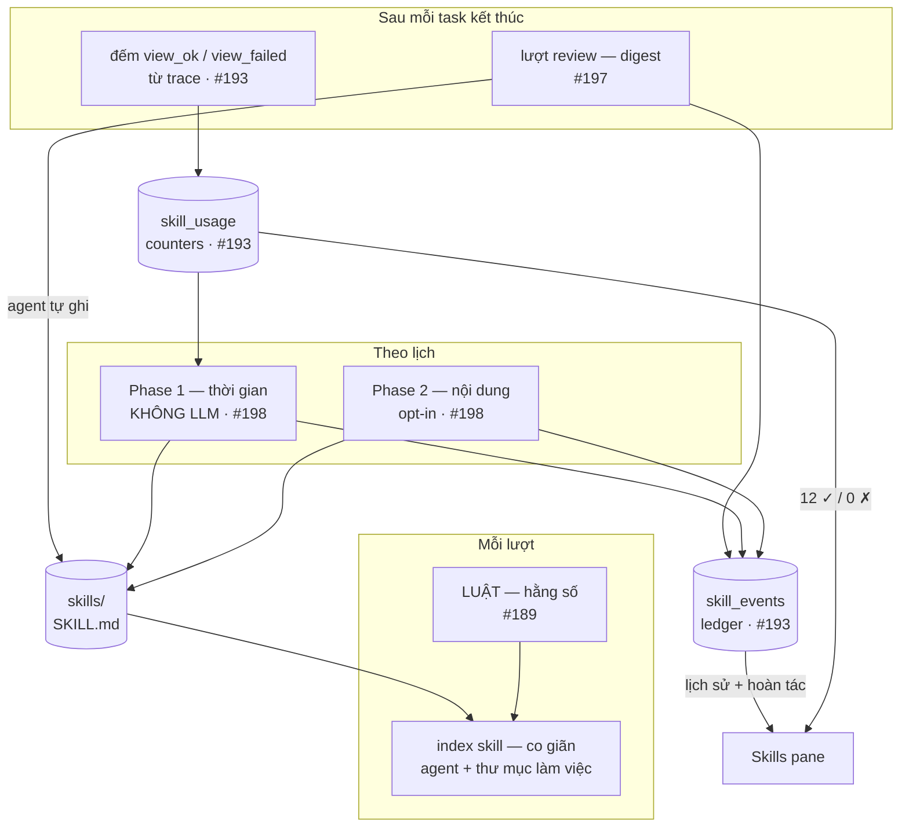
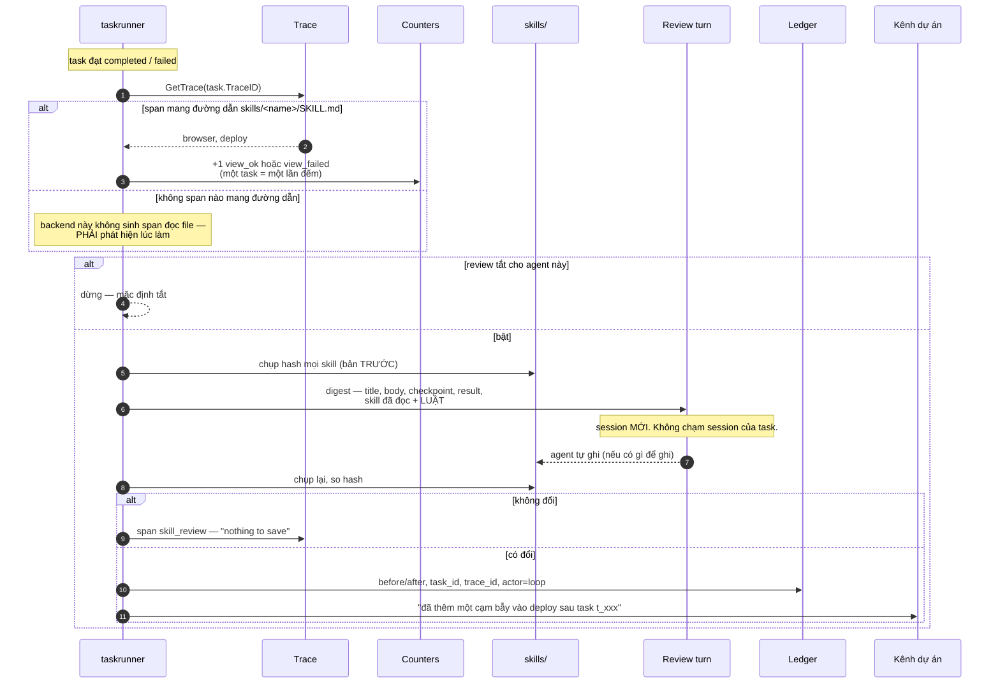

# Thiết kế: hệ kĩ năng tự học cho agent

Trạng thái: **thiết kế đã chốt, đang triển khai theo bốn bước**
Issue: #189 → #193 → #197 → #198
Nghiên cứu nền: [`docs/research/skill-learning-loop.md`](../docs/research/skill-learning-loop.md)
Cập nhật: 19/09/2026

---

## 1. Mục tiêu

Một agent làm xong việc và **giữ lại được thứ nó học ra**, ở dạng lần sau dùng được —
và người theo dõi được mọi thứ nó tự sửa.

### Phi mục tiêu

| Không làm | Vì sao |
|---|---|
| Kho skill dùng chung giữa các agent | phân kỳ là **mục đích**, xem §3.1 |
| Tải skill từ registry ngoài | code bên thứ ba là bề mặt tấn công, chưa có nhu cầu |
| Bắt chước fork cache-parity của hermes | đòi kiểm soát prompt gửi lên API; ba backend ở đây là CLI của người khác |
| Cưỡng chế read-before-write | không có chỗ đặt guard, xem §3.3 |

---

## 2. Mô hình

### 2.1 Skill là gì

Một thư mục, một `SKILL.md`, frontmatter khai `name` + `description`, hướng dẫn ở thân file.
Hình dạng theo AgentSkills/openclaw/hermes — giống nhau, nên skill di chuyển được giữa các hệ.

**`description` là tín hiệu định tuyến.** Nó vào prompt; thân file đọc theo nhu cầu.
Một bộ đồ nghề bao nhiêu skill cũng chỉ tốn vài trăm token khi không dùng tới.

### 2.2 Hai loại, hai chủ sở hữu

| | **Skill của agent** | **Skill của repo/dự án** |
|---|---|---|
| Ở đâu | `<workspace>/skills/` | `<repo>/.agents/skills/` |
| Nói về | **máy này** — `bomclaw browser`, `ch`, `artifact` | **codebase này** — deploy, migration, format issue |
| Theo agent đi đâu | khắp nơi | **hết hiệu lực khi agent làm việc khác** |
| Ai sửa | agent, người, vòng lặp | người, qua PR |

Một lượt thấy **cả hai**, gộp theo tên, **thư mục làm việc thắng** khi trùng tên: cách làm của
dự án đè cách làm chung — lý do duy nhất để có cả hai.

### 2.3 Ba tầng thời gian

| Tầng | Khi nào | Làm gì | Chi phí |
|---|---|---|---|
| **trong lượt** | agent thấy việc liên quan | đọc thân `SKILL.md` | ~0 |
| **sau lượt** | task kết thúc | xem lại, có thể sửa một skill | một lượt model |
| **định kỳ** | một lịch | dọn: stale/archive, gộp trùng | phần lớn **không LLM** |

Tách ra vì **ngân sách và rủi ro khác nhau**: việc chạy mỗi lượt không được đắt; việc ghi đè file
không được chạy khi người đang gõ; việc xoá phải hiếm và có ảnh chụp trước.

---

## 3. Ràng buộc — và cái nào là lợi thế

### 3.1 Ba agent, ba bản sao, phân kỳ là mục đích

Quyết định ở #180. Lý do: agent sẽ **tự sửa skill của chính nó**. Kho dùng chung nghĩa là
bài học của một agent **âm thầm viết lại hành vi của hai con chưa từng gặp tình huống đó**.

**Giá phải trả, nói thẳng:** vòng lặp chạy **ba lần song song và không tự cộng dồn**. Một agent
học được điều hay thì chết tại chỗ, trừ khi người bấm **chép sang**.

Muốn cộng dồn về sau: thứ cần thêm **không phải kho chung**, mà là một bước **đề xuất chép sang**
khi hai bản của cùng một skill lệch nhau và một bản rõ ràng tốt hơn.

### 3.2 Không cần fork — và ta có thứ hermes phải dựng lại

hermes xây `build_cache_parity_fork()` để lượt review đọc lại hội thoại mà không trả tiền hai lần.
Ở đây **CLI sở hữu session**, `--resume` là cơ chế gốc.

Và mỗi task đã có **`checkpoint` do chính agent viết cho lượt sau đọc** — đúng bản chưng cất mà
fork của họ phải tái tạo bằng `_digest_history`.

### 3.3 Không cưỡng chế được read-before-write

Guard của hermes sống trong tool layer **của họ**. Agent ở đây ghi bằng tool `Write` **của CLI** —
ta không đứng giữa.

> **Chiến lược thay thế: không ngăn được một lượt ghi tồi thì làm cho nó nhìn thấy được và hoàn tác được.**

Đây là mất mát thật. Ledger **không ngăn** một lượt ghi tồi — nó chỉ làm lượt đó **rẻ để sửa**.

### 3.4 Không dùng cơ chế skill của CLI

`internal/claude/client.go` truyền `--disable-slash-commands` có chủ đích: CLI nạp mọi thứ trong
`~/.claude/skills` — bộ đồ nghề của chủ máy — và một phần **cạnh tranh với việc của agent**.

Cờ đó cũng là **của riêng claude**. Máy này chạy claude, codex, opencode: một cơ chế trên một
backend là cơ chế **hai phần ba agent không có**.

→ Skill vào prompt dưới dạng **index**, agent tự `Read`. Chạy đồng nhất cả ba.

---

## 4. Kiến trúc



### 4.1 Vòng lặp một agent, đầy đủ



### 4.2 Vì sao chỉ chạy trên task đã kết thúc

**Không phải tối ưu hoá.** Nó đóng **bằng cấu trúc** con bug hermes phải ghi comment để tránh:
lượt review bị ghi vào session thật, rồi **lượt live kế tiếp đọc lại nó như một chỉ thị đang đứng**
(*curator takeover*).

Task `completed`/`failed` **không có lượt kế tiếp**. Và chế độ **digest** (không `resume`) làm lỗi
đó thành **không thể xảy ra** chứ không chỉ "đã tránh".

---

## 5. Dữ liệu

### 5.1 `skill_usage` — đếm theo **kết cục**

```
agent_id · skill · view_ok · view_failed · patch_count
last_view_at · last_patch_at · created_at
```

`last_activity = max(last_view_at, last_patch_at)` — **KHÔNG gồm `created_at`**.
Neo sai chỗ này thì **mọi skill mới tự archive ngay**.

**Vì sao hai cột chứ không một điểm:**

| | Cộng lại | Tách ra | Thật ra là |
|---|---|---|---|
| Chưa ai dùng | `0` | `0 ✓ / 0 ✗` | **chưa biết gì** — không phải lý do xoá |
| Dùng 12, hỏng 12 | `12` | `0 ✓ / 12 ✗` | **đang dạy sai** — phải sửa, không phải xoá |

Thông tin quan trọng nhất nằm đúng chỗ phép cộng làm mất. Đây cũng là **chiều dữ liệu hermes
không có**, và nó mở ra **hành động thứ ba**: *sửa vì nó đang gây hại* — không phải prune, không
phải gộp.

### 5.2 `skill_events` — ledger

```
agent_id · skill · action(create|patch|remove) · actor(loop|human|seed)
before · after · task_id · trace_id · created_at
```

**`before`/`after` lưu toàn văn, không diff.** Một `SKILL.md` vài KB, và giữ nguyên bản biến
*hoàn tác* thành **một lệnh ghi đè** thay vì **một phép áp patch có thể thất bại**.

**`actor` quyết định ai được đụng vào gì** ở §6.4 — **không bao giờ suy từ vị trí file**.

`task_id` + `trace_id` là câu trả lời cho *"sao nó lại làm thế?"*, dưới dạng **một cái link**.

---

## 6. Bốn bước

### 6.1 Bước 1 — luật (#189)

**Chỉ là chữ.** Một hằng số, một chỗ tách ngân sách.

Ba khối: **hình dạng bài học** · **thứ không được ghi** · **thứ tự hành động**, cộng một câu nói rõ
agent được sửa `SKILL.md` của chính nó.

**Phải đi trước.** Vòng lặp chạy trước khi có luật sẽ sinh ra đúng hình dạng hermes đã phải viết
linter để dọn: `SKILL.md` **100k ký tự** dày số PR, skill có **443 file reference**.

**Ngân sách tách đôi:** luật là hằng số, index co giãn. Chung một ngân sách thì agent nhiều skill
lên sẽ **đẩy luật ra khỏi prompt, im lặng**.

### 6.2 Bước 2 — counter + ledger (#193)

**Có ích ngay cả khi không bao giờ có vòng lặp**: hôm nay người sửa skill qua hub **không để lại
dấu vết gì**.

Và nó là **thứ duy nhất biến bước 3 từ đáng sợ thành hoàn tác được**.

Đếm **đọc từ trace** — không cần agent hợp tác ghi chép. Khớp **chuỗi `/skills/` + `/SKILL.md`
trong `inputs` của span**, không khớp theo tên tool: ba backend không chắc đặt tên giống nhau.

### 6.3 Bước 3 — vòng lặp (#197)

Digest, không resume. Tối đa **một skill mỗi lượt** — một task dạy một bài học; không có giới hạn
thì một lượt review viết lại nửa thư viện và ledger thành bãi diff không ai đọc.

Bắt thay đổi **không cần tool layer**: chụp hash trước, so sau. Honest hơn — nó bắt **mọi** thay đổi
agent làm, vì bất kỳ lý do gì.

**Mặc định TẮT.** Một lượt model cho mỗi task kết thúc × ba agent, agent 1 chạy Opus.

### 6.4 Bước 4 — curator (#198)

**Hai phase, hai thước đo, hai quyền.** Không phải hai bước của một quy trình.

| | **Phase 1 — staleness** | **Phase 2 — consolidation** |
|---|---|---|
| Chạy bằng | máy trạng thái, **không LLM** | một lượt model |
| Thước đo | **thời gian**, và chỉ thời gian | **nội dung trùng lặp**, và chỉ nội dung |
| Được làm | stale · archive · reactivate | gộp umbrella · demote `references/` |
| **Không** được làm | không phán hay/dở | **không bao giờ prune** |
| Mặc định | bật | **tắt** |

Phase 2 **về mặt cấu trúc không thể đánh mất nội dung**: mọi `delete` bắt buộc khai
`absorbed_into=<umbrella>`, umbrella phải tồn tại sẵn, không có đích thì **bị từ chối**.

**Thước đo của Phase 2 không phải counter** — hermes **cấm** dùng: *"`use=0` is not evidence a skill
is valuable; it's absence of evidence either way."* Cái bar đúng: **"một người bảo trì sẽ viết N
skill riêng, hay một skill với N mục có nhãn?"** Hỏi *"hai cái này có khác nhau không"* thì **luôn**
ra "có", nên cái bar đó không bao giờ gộp được gì.

Ngưỡng 14/30 ngày là nhịp của hermes — **phải đo** ở đây, ba agent chạy vài chục lượt mỗi ngày.

---

## 7. Nhật ký quyết định

| # | Quyết định | Lý do | Cái mất |
|---|---|---|---|
| 1 | Mỗi agent một bản sao, không kho chung | agent sẽ tự sửa; bài học một con không được viết lại hành vi hai con kia | không tự cộng dồn |
| 2 | Index vào prompt, không dùng skill của CLI | cờ đó của riêng claude; ba backend | agent phải chủ động `Read` |
| 3 | Đọc lại index **mỗi lượt** | bộ đồ nghề chỉ đổi được bằng restart thì không ai sửa | vài lần đọc file mỗi lượt |
| 4 | Skill của repo ở `.agents/skills/` | quy trình deploy của repo A **sai** khi agent làm repo B | cần biết thư mục làm việc của lượt |
| 5 | Ledger thay guard | không có chỗ đặt guard | **không ngăn được** ghi tồi, chỉ hoàn tác được |
| 6 | Chỉ review task đã kết thúc | đóng *curator takeover* bằng cấu trúc | task dài không học giữa chừng |
| 7 | Digest, không resume | rẻ + **stateless** | mất nguyên văn hội thoại |
| 8 | Đếm tách `view_ok`/`view_failed` | `0 ✓ / 12 ✗` **là** bằng chứng, không phải "ít dùng" | hai cột thay vì một |
| 9 | Archive, không delete | bản ghi do bug vẫn chứa việc thật | thư viện lớn dần |
| 10 | Phase 1 và Phase 2 tách quyền | prune bằng nội dung là cách mất nội dung | hai cơ chế thay vì một |

---

## 8. Rủi ro

**Agent tự dạy mình từ chối làm việc.** Nguy hiểm nhất. Nó ghi *"browser không hoạt động"* sau một
lỗi nhất thời, rồi **trích dẫn chính nó để từ chối** hàng tháng sau khi lỗi đã sửa.
→ **#189 là phòng tuyến duy nhất**, và nó là **chữ trong prompt**, không phải guard.

**Guard không khớp bề mặt.** hermes chặn `read_file` cho fork review trong khi guard đòi đọc tươi
trước khi vá: **~142 denial + ~204 refusal trong 2 ngày**, gần như không patch nào đáp xuống.
→ Mọi rào mới phải kiểm **cả hai chiều**: rào đòi gì, và caller với tới được gì.

**Backend không sinh span đọc file.** Skill của agent đó **đếm ra 0 mãi mãi**, trông y hệt
"chưa ai dùng", rồi curator archive nhầm cả thư viện.
→ Nghiệm thu #193 bắt buộc `✓/✗` khác 0 **trên cả ba agent**.

**Ngân sách prompt.** Sáu skill hệ thống đã chiếm **2310/4000 rune**; agent 1 với 8 skill là
**2497**. Khi tràn, **skill agent tự viết là thứ bị cắt trước**.
→ Test giữ ngưỡng hai phần ba, và #189 tách ngân sách.

---

## 9. Trạng thái hiện tại

| | Xong | Ghi chú |
|---|---|---|
| Skill của agent, index vào prompt | ✅ | #181 |
| Bộ mặc định — `artifacts` `browser` `channels` | ✅ | #182, mỗi cái một lệnh `bomclaw` |
| Hub — duyệt/nạp/gỡ/chép sang | ✅ | #182 |
| Panel đọc, render markdown | ✅ | #196 |
| Đọc layout lồng `<cat>/<name>/` | ✅ | #185 |
| Skill của repo ở `.agents/skills/` | ✅ | #195 — `plan` `review` `implement` |
| Roster nêu skill của peer | ✅ | #183 |
| **Luật** | ⬜ | #189 |
| **Counter + ledger** | ⬜ | #193 |
| **Vòng lặp** | ⬜ | #197 |
| **Curator** | ⬜ | #198 |

**Một chỗ chưa nối:** skill của repo chỉ load khi lượt chạy **trong thư mục repo**. Agent đang chạy
ở `~/goterm-workspace*` nên **chưa thấy** `plan`/`review`/`implement`. Cần một channel dự án trỏ
workspace vào repo — `ch new` hiện tạo folder mới chứ không nhận đường dẫn có sẵn.

---

## 10. Tham chiếu

- [`docs/research/skill-learning-loop.md`](../docs/research/skill-learning-loop.md) — khảo sát hermes, có `file:line`
- `internal/skills/` — `skills.go` (load, index) · `manage.go` (ghi) · `defaults.go` (bộ mặc định) · `roster.go`
- `internal/gateway/skills.go` — RPC của hub
- `.agents/skills/` — skill của chính repo này
