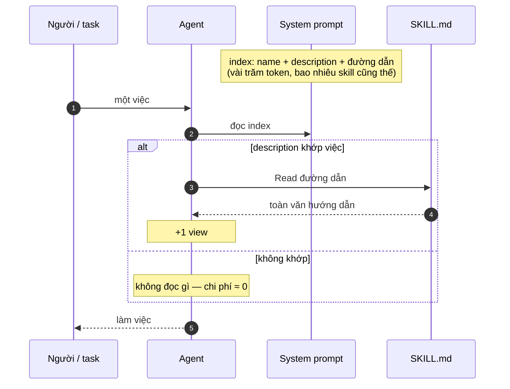
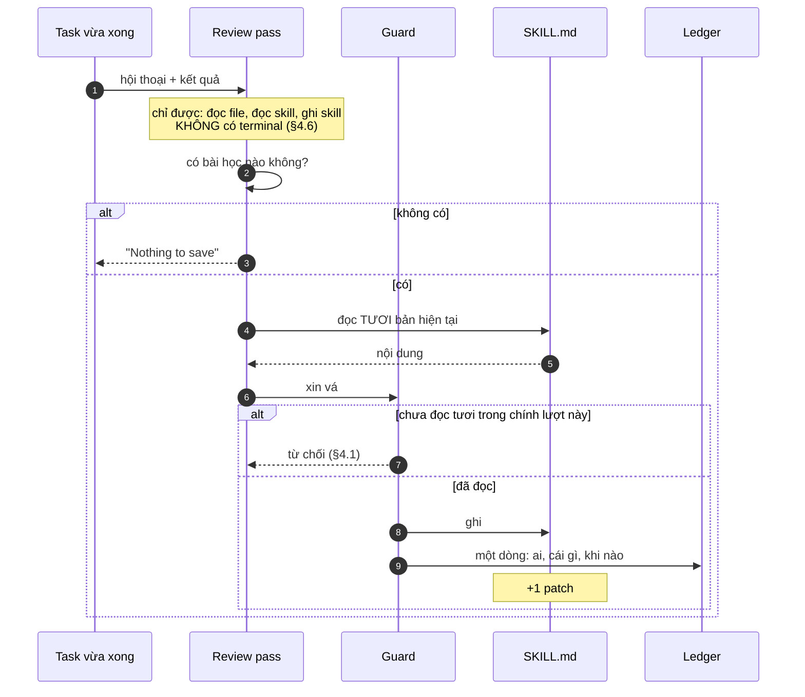
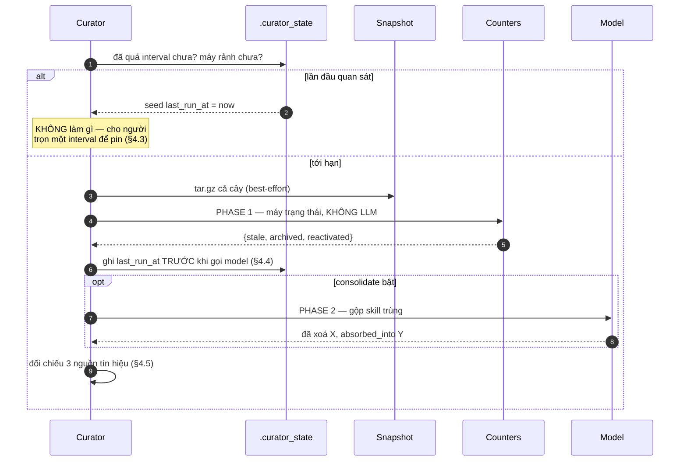
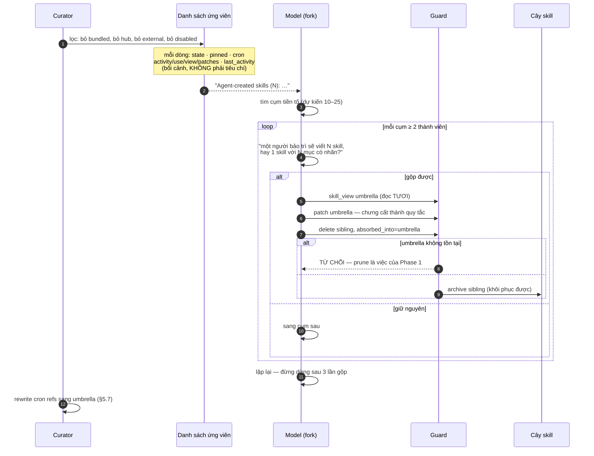
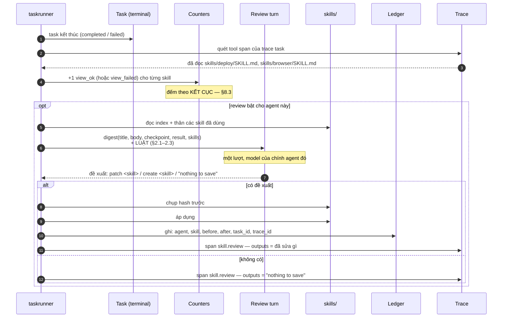

# Vòng lặp học kĩ năng — hermes-agent dạy được gì cho hệ này

> Đọc từ `~/Documents/projects/hermes-agent` @ `main` và `hermes-memory-skills-deep-dive.md`.
> Ngày đọc: 2026-09-17. Đối chiếu với `internal/skills`, `internal/memory`, `internal/taskrunner`.

Tài liệu này **không tóm tắt hermes**. Nó trả lời một câu: *cái gì trong đó áp được vào đây, theo thứ
tự nào, và cái gì thì không.*

---

## 0. Chỗ ta đang đứng

| | hermes | ở đây |
|---|---|---|
| Skill là gì | thư mục + `SKILL.md`, frontmatter `name`/`description` | **giống hệt** |
| Vào prompt thế nào | index `name + description`, thân đọc theo nhu cầu | **giống hệt** |
| Ai sở hữu | mỗi agent một bản | **giống hệt** (PR #182) |
| Đổi được lúc chạy | có | **có** — index đọc lại mỗi lượt |
| **Ai sửa skill** | **agent tự sửa, sau mỗi ~10 lượt** | **chỉ người, qua hub** |
| **Đếm mức dùng** | `.usage.json` — counter, state, pinned, created_by | **không có** |
| **Bảo trì dài hạn** | curator: active → stale → archived | **không có** |

Nền đã xong. Thiếu đúng **vòng lặp**: không gì ở đây khiến một skill **tự tốt lên**.

---

## 1. Ba tầng thời gian

hermes tách việc học thành ba tầng, mỗi tầng một ngân sách và một mức rủi ro:

| Tầng | Khi nào | Làm gì | Chi phí |
|---|---|---|---|
| **trong lượt** | agent thấy việc liên quan | `skill_view` → đọc thân file | ~0 |
| **sau lượt** | mỗi ~10 lượt, hoặc `/refine` | fork xem lại hội thoại, **sửa skill** | một lần gọi model |
| **hàng tuần** | máy rảnh ≥ N giờ | curator: stale/archive, gộp skill trùng | phần lớn **không LLM** |

Điểm đáng học không phải ba con số, mà **vì sao tách**: một việc chạy mỗi lượt không được phép đắt;
một việc ghi đè file không được phép chạy khi người đang gõ; một việc xoá thứ gì đó phải chạy hiếm và
có ảnh chụp trước.

Ở đây ta mới có **tầng một**.

---

## 2. Phần đắt giá nhất lại là phần rẻ nhất để bê về

Ba khối prompt của hermes là **triết lý học viết thành luật**. Chúng là *chữ*, không phải code — nên
chi phí gần bằng không, và giá trị thì cao nhất trong cả tài liệu.

### 2.1 Hình dạng của một bài học

> Skill = hướng dẫn làm **một lớp việc** theo cách user này muốn, sao cho session sau làm đúng **ngay
> lần đầu**.

- **Quy trình trước**: các bước đúng thứ tự, kèm lệnh cụ thể. Bài học **gắn vào bước nó ảnh hưởng**,
  không gom thành mục "Lessons" cuối file.
- **Một cạm bẫy = quy tắc tổng quát + một mệnh đề VÌ SAO**, viết ở thể mệnh lệnh. Không phải tường
  thuật chuyện đã xảy ra.
- **Không số PR, không ngày, không ticket, không trích chat làm nội dung.** Quy tắc phải đứng vững mà
  không cần câu chuyện đằng sau.
- **Cùng một bài học hai lần = MỘT quy tắc**, được làm mạnh lên — không nối thêm bản sao.
- **Sai thì sửa tại chỗ**, không nối `"UPDATE: actually…"` bên dưới.

Cái cuối là lý do họ có linter bắt `incident-log-shape`: một `SKILL.md` **100k ký tự** dày đặc số PR,
và một skill có **443 file reference kiểu một-file-một-session**. Đó là hình dạng một vòng lặp không
có luật sẽ tự trôi tới.

### 2.2 Thứ tuyệt đối không được thành skill

Mở đầu bằng lý do: *chúng biến thành ràng buộc tự áp đặt vĩnh viễn, cắn lại khi môi trường đổi.*

- **Lỗi phụ thuộc môi trường** — thiếu binary, sai path, chưa cấu hình credential. User sửa được.
- **Khẳng định phủ định về tool** — *"browser không hoạt động"*, *"X bị hỏng"*.
  → *"These harden into refusals the agent cites against itself for months after the actual problem
  was fixed."*
  **Đây là failure mode nguy hiểm nhất của self-improvement: agent tự dạy mình từ chối làm việc.**
- **Thất bại chưa giải quyết** — session thử vài thứ, không cái nào được, rồi bảo user tự kiểm. Viết
  đống đó thành "workflow đáng tin cậy" là *trình bày một chuỗi thất bại chưa kiểm chứng như hướng dẫn
  đã validate mà session sau sẽ tin và lặp lại*. Hoặc nói "không có gì để lưu", hoặc **chỉ** ghi
  phương án mình **thực sự tự tin**.
- Tool hỏng vì **setup state** → ghi **CÁCH SỬA** vào mục troubleshooting, **không bao giờ** ghi "tool
  này không hoạt động" như một ràng buộc độc lập.

### 2.3 Thứ tự hành động — chọn cái **sớm nhất** phù hợp

1. Vá skill **đang được load trong session** — nó đang ở trong cuộc.
2. Vá một **umbrella đã có** — thêm subsection, thêm pitfall, mở rộng trigger.
3. Thêm **file hỗ trợ** dưới umbrella có sẵn (`references/<chủ-đề>.md`, đặt tên theo **chủ đề**, không
   theo session/sự cố), và SKILL.md nhận **một dòng trỏ** tới nó.
4. Tạo skill mới — **chỉ khi** không cái nào phủ được lớp việc đó. Tên phải ở **mức lớp**:
   *"nếu cái tên chỉ có nghĩa với task hôm nay thì nó sai."*

Đây là thứ chặn sprawl. Không có nó, mỗi bài học đẻ ra một skill mới.

### 2.4 Tín hiệu hạng nhất

User sửa **style / tone / format / độ dài** của bạn — *"stop doing X"*, *"quá dài dòng"*, *"cứ trả lời
thẳng đi"* — là **tín hiệu SKILL hạng nhất, không chỉ tín hiệu memory**. Vì memory nói *"user là ai"*,
skill nói *"làm lớp việc này cho user này thế nào"*.

Và: *"một pass không làm gì là **cơ hội học bị bỏ lỡ**, không phải kết quả trung tính"* — nhưng
"không có gì để lưu" vẫn là lựa chọn thật.

---

## 3. Bài học vận hành đắt nhất trong cả tài liệu

Fork review của họ ban đầu **chặn `read_file`/`search_files`** cho an toàn. Kết quả đo được trên một
deployment thật:

> **~142 denial + ~204 read-before-write refusal trong 2 ngày.**

Vì sao: guard bắt buộc phải `skill_view` **tươi** trước khi vá. Model thì tự nhiên với tay lấy
`read_file` để xem skill — bị từ chối — nên **không bao giờ load file theo cách guard yêu cầu**, và
**gần như không patch nào đáp xuống**. Vòng lặp tự cải thiện **chết đói bởi chính guard của nó**.

> **Guard và bề mặt tool phải khớp nhau. Một guard đòi hành vi X mà whitelist cấm phương tiện làm X
> thì hệ thống không an toàn hơn — nó chỉ ngừng hoạt động.**

Cùng họ với lỗi ta đã gặp ở đây: `--disable-slash-commands` tắt skill của CLI vì nó cạnh tranh với
`bomclaw browser`; chặn đúng, nhưng nếu ta cũng chặn luôn đường agent đọc `SKILL.md` thì index sẽ là
một danh sách tên vô dụng.

---

## 4. Những cơ chế đáng bê, và cái giá thật của chúng

### 4.1 Read-before-write (rẻ, làm sớm)

Trước khi vá một `SKILL.md` đã tồn tại, phải **đọc tươi nó trong chính lượt đó**. Nội dung được trích
trong transcript **không tính** — nếu không, fork sẽ vá thứ nó chỉ *suy ra* từ hội thoại, và đó chính
là cách sinh ra bản ghi đè mất nội dung.

### 4.2 Provenance quyết định ai được đụng vào gì (rẻ)

`.usage.json` giữ `created_by`, và **chỉ trường đó** quyết định curator được động vào skill nào —
**không bao giờ suy từ vị trí file**.

| `created_by` | curator quản? |
|---|---|
| `agent` (fork tạo ra) | ✅ |
| `learn` (user chỉ đạo tạo) | ❌ |
| vắng (viết tay, có từ trước) | ❌ |

Hệ quả họ cảnh báo: thư viện **trông** như được curate trong khi phần lớn nằm ngoài tầm với. Nên có
`curator list-unmanaged` và `curator adopt` — **chuyển giao bằng tuyên bố tường minh**.

Ở đây trường tương đương sẽ là: skill nào do **bộ mặc định** gieo, skill nào do **người** viết qua hub,
skill nào do **vòng lặp** đẻ ra. Ta đã có một nửa — cờ `bundled`/`đã sửa` trong hub.

### 4.3 Máy trạng thái curator (rẻ — **không cần LLM**)

`active → stale (14d) → archived (30d)`, và **`reactivated` là chuyển dịch hai chiều**: skill stale
được dùng lại thì **tự quay về active**. Không có chiều ngược, mọi skill đều rơi xuống đáy theo thời gian.

Hai chi tiết nhỏ mà sai là hỏng hẳn:

- **Anchor = `last_activity ?? created_at ?? now`.** Neo vào epoch thì **mọi skill mới tự archive ngay**.
- **Lần quan sát đầu tiên không làm gì** — seed `last_run_at = now` rồi thôi. Cài mới được trọn một
  interval để người kịp xem và pin thứ quan trọng **trước khi** curator chạm vào.
- **Cron-referenced = pinned.** `use_count` chỉ tăng khi job bắn, nên job chạy thưa sẽ làm skill của
  nó già đi rồi **bị archive ngay dưới chân job**.

### 4.4 Persist trước khi gọi LLM (rẻ)

Ghi `last_run_at` **trước** khi gọi model: crash giữa chừng vẫn tính là đã chạy, **không lặp vô hạn
một pass hỏng**. Snapshot là **best-effort** — *"một lỗi đĩa nhất thời không được âm thầm vô hiệu hoá
curator vĩnh viễn"*. Dry-run **không** bump đồng hồ, nhưng **vẫn** viết report.

### 4.5 Không tin lời tự thuật của model, cũng không vứt nó (vừa)

Khi phân loại "skill này biến mất vì được gộp hay vì bị xoá", họ dùng **ba nguồn có thứ tự tin cậy**:
khai báo **tại điểm hành động** > tự thuật **sau khi xong** > **audit từ tool call**. Mỗi kết luận mang
theo `source` để người đọc biết nó đến từ đâu.

Bắt được đúng hai lỗi: **umbrella bịa ra** và **bỏ sót khỏi bản tóm tắt**.

### 4.6 Bỏ hẳn `terminal` khỏi fork — đóng lỗ bằng **cấu trúc** (rẻ)

Một `mv`/`rm` qua shell dưới cây skills ghi đúng bytes nhưng **không sinh ledger entry**, nên bản
archive sau đó chụp một package đã bị rút ruột và rollback khôi phục ra skill rỗng. Cách sửa **không
phải** heuristic dò lệnh nguy hiểm — mà là **bỏ hẳn toolset**: *"no command heuristic can."*

### 4.7 Cache-parity fork — **không áp được**

Fork giữ system prompt byte-identical với cha để trúng prefix cache: đo được **~26% rẻ hơn**. Kĩ thuật
đẹp, nhưng nó đòi kiểm soát prompt gửi lên API. Ở đây ba backend đều là **CLI của người khác** — ta
không cầm cache key. Ghi lại để biết, đừng cố bắt chước.

---

## 5. Áp vào đây — bốn bước, theo đúng thứ tự phụ thuộc

### Bước 1 — Luật, không code *(rẻ nhất, giá trị cao nhất)*

Thêm vào khối skill index: **hình dạng bài học** (§2.1), **danh sách không-được-ghi** (§2.2), **thứ tự
hành động** (§2.3). Cộng một câu nói rõ agent **được phép sửa `SKILL.md` của chính nó**, vì hôm nay
không gì nói với nó điều đó.

Làm được ngay, không cần hạ tầng nào. Và nó **phải đi trước**: một vòng lặp chạy trước khi có luật sẽ
sinh ra đúng đống 443-file mà họ đã phải viết linter để dọn.

### Bước 2 — Đếm mức dùng

Không có counter thì không có curator. Chỗ khó: ta **không nhìn thấy** agent đọc `SKILL.md` — nó dùng
tool `Read` của CLI, ta chỉ thấy một tool span tên `Read`.

Ba cách, chọn một:
- **Đọc từ trace**: ta đã có tool span; khớp đường dẫn `skills/<name>/SKILL.md` trong `inputs`. Không
  cần agent hợp tác, nhưng phụ thuộc hình dạng span của từng backend.
- **`bomclaw skills used <name>`**: chính xác, nhưng cần agent nhớ gọi — cùng loại vấn đề với
  `msg --task` mà ta vừa phải sửa bằng prompt.
- **mtime**: rẻ nhất, sai nhiều nhất.

Khuyến nghị: **đọc từ trace**. Tag đã có từ #126 làm chỗ này dễ hơn.

### Bước 3 — Pass review sau lượt

Chỗ đắt. Ta **không có fork** và không có cache parity để làm nó rẻ. Hình dạng khả dĩ ở đây: một
**task** mở ra sau khi một task khác kết thúc, chạy với prompt review và **chỉ** được dùng công cụ
đọc + ghi skill.

Trước khi làm, phải trả lời: **kích hoạt bằng gì?** Của họ là đếm lượt. Ở đây một "lượt" trải trên ba
làn — chat, mention, task — và task là chỗ có bài học đáng học nhất. Đề xuất: **sau mỗi task
completed**, không phải sau mỗi N lượt chat.

Và **read-before-write guard (§4.1) phải vào cùng bước này**, không phải sau.

### Bước 4 — Curator

Chỉ có nghĩa sau bước 2. Phần lớn **không cần LLM** (§4.3), nên nó rẻ hơn bước 3 dù nghe to hơn.
Phase gộp-skill-trùng cần LLM thì để **opt-in**, đúng như họ.

---

## 6. Rủi ro phải nhận trước

**Ba agent, ba bản sao, phân kỳ là mục đích** (quyết định ở #180). Nghĩa là một vòng lặp chạy **ba lần
song song** trên ba bản khác nhau của cùng một skill. Không có gì hợp nhất chúng ngoài nút **chép sang**
trong hub — tức là **một con người phải nhìn hai bản rồi quyết**.

Đó là đánh đổi đã chọn có ý thức, nhưng nó có nghĩa: **vòng lặp tự cải thiện ở đây không tự cộng dồn
giữa các agent.** Nếu về sau muốn nó cộng dồn, thứ cần thêm không phải là thư viện chung — mà là một
bước **đề xuất chép sang** khi hai bản của cùng một skill lệch nhau và một bản rõ ràng tốt hơn.

**Và cái rủi ro lớn nhất vẫn là §2.2**: một agent tự dạy mình rằng một công cụ hỏng, rồi trích dẫn
chính nó để từ chối làm việc, hàng tháng sau khi sự cố đã được sửa.

---

## 7. Sequence — ba tầng, ai gọi ai

### 7.1 Trong lượt: skill chỉ tốn tiền khi được dùng



Đây là phần **đã chạy** ở đây. `description` là **tín hiệu định tuyến**; thân file là thứ trả tiền
theo nhu cầu.

### 7.2 Sau lượt: chỗ việc học thật sự xảy ra *(chưa có ở đây)*



Bước `đọc TƯƠI` là chỗ hermes suýt chết: guard đòi nó, nhưng whitelist ban đầu **cấm phương tiện thực
hiện nó** (§3).

### 7.3 Hàng tuần: curator *(chưa có ở đây)*



---

## 8. Đối tượng tác động, trọng số, và công thức

### 8.1 Ai được đụng vào việc học, và mạnh đến đâu

Không phải mọi tín hiệu đều ngang nhau. hermes phân quyền theo **ai là tác nhân**, không theo file nằm
ở đâu:

| Tác nhân | Được sửa skill nào | Sức nặng | Vì sao |
|---|---|---|---|
| **Người, foreground** | tất cả | **tuyệt đối** | người đang ngồi đó; `pinned` chặn cả agent |
| **Người, sửa style/tone** | — (là *tín hiệu*) | **hạng nhất** | *"quá dài dòng"* ⇒ skill quản việc đó phải mang bài học |
| **Agent, foreground** (`/learn`) | tạo mới → `created_by=learn` | cao | user chỉ đạo ⇒ **curator không đụng** |
| **Review fork** | chỉ skill `created_by=agent` | vừa | tự chủ, không người giám sát |
| **Curator** | chỉ skill `created_by=agent` | thấp | chỉ dọn, và có snapshot trước |
| **Cron job tham chiếu** | — (là *lá chắn*) | = pinned | `use_count` chỉ tăng khi job bắn |
| **Linter / validator** | — (là *rào*) | chặn / cảnh báo | validator **chặn**, linter **chỉ cảnh báo** |

Dòng quan trọng nhất là dòng thứ hai: **lời phàn nàn của người về *cách* một việc được làm là tín hiệu
SKILL, không phải tín hiệu memory.** Memory nói *"user là ai"*; skill nói *"làm lớp việc này cho user
này thế nào"*.

### 8.2 Công thức của hermes: **không có**

Cần nói thẳng, vì dễ tưởng là có. `tools/skill_usage.py`:

```python
def activity_count(record):
    return sum(record.get(k) for k in ("use_count", "view_count", "patch_count"))
```

**Tổng không trọng số** của ba loại sự kiện:

| Sự kiện | Tăng khi | Mốc thời gian |
|---|---|---|
| `use` | skill được gọi (slash command, cron job) | `last_used_at` |
| `view` | `skill_view` đọc thân file | `last_viewed_at` |
| `patch` | vòng lặp sửa nó | `last_patched_at` |

Và mốc tuổi:

```
last_activity_at = max(last_used_at, last_viewed_at, last_patched_at)
```

với một chi tiết được ghi thành comment: **`created_at` bị loại khỏi phép max** — *"so never-active
skills stay distinguishable"*. Skill chưa từng hoạt động phải **phân biệt được** với skill vừa dùng.

Toàn bộ "trọng số" nằm trong **các cổng**, không nằm trong một con số:

| Cổng | Giá trị | Tác dụng |
|---|---|---|
| stale | 14 ngày không hoạt động | đánh dấu, chưa đụng |
| archive | 30 ngày | chuyển vào `.archive/` |
| sàn ân hạn | `use_count == 0` và còn trẻ hơn stale | **không đụng** — skill mới có thời gian |
| reactivate | dùng lại sau khi stale | **quay về active** — chuyển dịch hai chiều |
| pinned / cron-referenced | — | miễn nhiễm hoàn toàn |
| nudge | 10 lượt user / 15 iteration | khi nào fork chạy |

**Đây là một lựa chọn, không phải một thiếu sót.** Một tổng không trọng số cộng vài ngưỡng thời gian
thì **giải thích được** — người đọc report hiểu vì sao một skill bị archive. Một điểm số có hệ số thì
không ai truy được, và khi nó sai thì không ai biết chỉnh cái gì.

### 8.3 Công thức cho hệ này

Ở đây khác hermes ở **một điểm quyết định**: ta **không** thấy `skill_view` như một sự kiện riêng — agent
đọc bằng tool `Read` của CLI, ta chỉ thấy một tool span. Nhưng ta thấy một thứ hermes không có:
**kết cục của công việc**. Mỗi task có `state`, và mỗi lượt có một trace.

Nên tín hiệu mạnh nhất ở đây không phải *"skill này được đọc bao nhiêu lần"* mà **_"skill này được đọc
trong những việc đã thành công bao nhiêu lần"_**.

Đề xuất — giữ đúng nguyên tắc *giải thích được* của họ, chỉ thêm đúng một chiều mà ta có dữ liệu:

```
activity(s) = view_ok(s) + view_failed(s) + patch(s)

   view_ok      số lần SKILL.md được đọc trong một task kết thúc completed
   view_failed  … trong một task kết thúc failed / canceled
   patch        số lần skill được sửa (bởi người hoặc bởi vòng lặp)

last_activity(s) = max(mọi mốc thời gian ở trên)      # KHÔNG gồm created_at

state(s):
   pinned hoặc được một schedule tham chiếu   → miễn nhiễm
   chưa từng có hoạt động và created_at trẻ hơn stale_cutoff → miễn nhiễm (sàn ân hạn)
   last_activity ≤ now − 30d                 → archived
   last_activity ≤ now − 14d                 → stale
   last_activity >  now − 14d và đang stale   → active   (hai chiều)
```

**Vì sao tách `view_ok` / `view_failed` thay vì gán hệ số.** Một con số `0.3 × view_failed` thì không
ai truy được. Hai cột thì đọc ra ngay: một skill có `view_ok = 0, view_failed = 12` **không phải là
skill ít dùng — nó là skill đang dẫn người ta đi sai**, và đó là thứ đáng đưa lên đầu report chứ không
phải đáng đem archive.

Đây cũng là chỗ **#126 vừa làm cho khả thi**: trace đã có tag `channel:` / `message:`, và một task đã
có trace riêng — nên "skill nào được đọc trong task nào, task đó kết thúc ra sao" là một câu **join
được**, không cần agent hợp tác ghi chép.

### 8.4 Ngưỡng nào phải đo trước khi chốt

Ba con số dưới đây **không được bê nguyên** từ hermes, vì nhịp ở đây khác hẳn:

| Ngưỡng | hermes | ở đây cần đo |
|---|---|---|
| **stale** | 14 ngày | ba agent, mỗi ngày vài chục lượt — 14 ngày có thể là cả một kỉ nguyên |
| **archive** | 30 ngày | như trên |
| **kích hoạt review** | mỗi 10 lượt user | ở đây đề xuất **sau mỗi task completed**, vì một "lượt" trải trên ba làn và task là nơi có bài học đáng học nhất |

Và một con số **phải đo ngay khi làm bước 1**: khối luật (§2) vào **mọi prompt**. `MaxIndexRunes` hiện
là 4000 cho **cả** index. Luật là hằng số, index co giãn theo số skill — nếu để chung một ngân sách thì
agent thứ mười lăm sẽ đẩy luật ra ngoài mà không ai thấy.

---

## 9. Phase 1 và Phase 2 — hai thước đo, không phase nào làm được việc của phase kia

Đây là chỗ dễ hiểu nhầm nhất khi nhìn sequence: hai phase **không phải hai bước của một quy trình**.
Chúng đo hai thứ khác nhau và có hai quyền khác nhau.

| | **Phase 1 — staleness** | **Phase 2 — consolidation** |
|---|---|---|
| Chạy bằng | máy trạng thái, **không LLM** | một fork gọi model |
| Thước đo | **thời gian**, và chỉ thời gian | **nội dung trùng lặp**, và chỉ nội dung |
| Được làm | stale · archive · reactivate | gộp vào umbrella · demote xuống `references/` |
| **Không** được làm | **không bao giờ phán skill hay hay dở** | **không bao giờ prune** |
| Bật/tắt | luôn chạy khi curator bật | **opt-in** |

Câu trong prompt của họ khoá chặt ranh giới này:

> *"pruning with no absorption target is the **deterministic staleness pass's job, never this one's**."*

`skill_manage action=delete` **bắt buộc** kèm `absorbed_into=<umbrella>`, và umbrella đó **phải tồn tại
sẵn**. Delete không có đích chuyển tiếp đã xác minh thì **bị từ chối**. Nên Phase 2 về mặt cấu trúc
**không thể** làm mất một skill — nó chỉ có thể **dời** nội dung.

Và ngay cả Phase 1 cũng không xoá: *"Archiving is the maximum destructive action. Archives are
recoverable; deletion is not."*

### 9.1 Thước đo của Phase 2 **không phải** counter

Đây là điều bất ngờ nhất khi đọc source, và nó ngược với trực giác. Nguyên văn quy tắc 4:

> *"**DO NOT use usage counters as a reason to skip consolidation.** The counters are new and often
> mostly zero. Judge overlap on **CONTENT**, not on use_count. `use=0` is not evidence a skill is
> valuable; it's **absence of evidence either way**. Corollary: `use=0` is ALSO **not a reason to
> PRUNE**."*

Counter vẫn **được in ra** trong danh sách ứng viên — `activity=… use=… view=… patches=…` — nhưng như
**bối cảnh**, không phải như tiêu chí. Một skill `use=0` chỉ được đụng tới khi **đủ cả hai**: ≥ 30 ngày
tuổi **và** nội dung thật sự lỗi thời hoặc đã được hấp thụ nơi khác. Lý do ghi thẳng: *"a
recently-created skill simply may not have had its trigger come up yet."*

### 9.2 Vậy thước đo là gì: **bài kiểm tra người bảo trì**

Quy tắc 5 nêu ra cái bar, và nó bác bỏ cái bar mà hầu hết người ta sẽ chọn:

> *"DO NOT reject consolidation on the grounds that 'each skill has a distinct trigger'. **Pairwise
> distinctness is the wrong bar.** The right bar is: **'would a human maintainer write this as N
> separate skills, or as one skill with N labeled subsections?'** When the answer is the latter, merge."*

Tức là: hỏi *"hai cái này có khác nhau không"* thì **luôn** ra câu trả lời "có" — mọi skill đều khác
nhau ở điểm nào đó, nên cái bar đó **không bao giờ gộp được gì**. Câu hỏi đúng là về **hình dạng thư
viện mà một người sẽ viết ra**.

Và mục tiêu được phát biểu như một thất bại cần tránh:

> *"A collection of hundreds of narrow skills where each one captures one session's specific bug is a
> **FAILURE of the library — not a feature**."*

### 9.3 Một con số cứng: **57 ký tự**

> *"An agent searching skills matches on **descriptions**, not on exact names (note: long descriptions
> are truncated to **57 chars** in the system prompt skill index — keep the trigger class in that
> window)."*

Đây là ràng buộc vật lý đẻ ra cả chiến lược umbrella: nếu agent chỉ nhìn 57 ký tự đầu để định tuyến,
thì **một umbrella rộng với các subsection có nhãn dễ tìm hơn năm skill hẹp** — ngược hẳn với trực giác
"chia nhỏ cho rõ ràng".

*(Ở đây `MaxDescriptionRunes` đang là **400** và ta in trọn vào index. Rộng hơn nhiều, nên ràng buộc
này nhẹ hơn — nhưng nó cũng có nghĩa index của ta **đắt hơn của họ trên mỗi skill**.)*

### 9.4 Phương pháp: cụm tiền tố

Không phải so từng cặp — mà **quét tìm cụm**:

> *"Identify **PREFIX CLUSTERS** (skills sharing a first word or domain keyword)… `hermes-config-*`,
> `gateway-*`, `codex-*`, `pr-*`… **Expect 10–25 clusters.**"*
>
> *"For each cluster with 2+ members, do NOT ask 'are these pairs overlapping?' — ask **'what is the
> UMBRELLA CLASS these skills all serve?'**"*

Cộng một tín hiệu độc lập: **tên quá hẹp**. Tên chứa số PR, codename, một chuỗi lỗi cụ thể, hay dấu vết
một phiên làm việc (`audit-`, `diagnosis-`, `salvage-`) — *"these almost always belong as a subsection
or support file under a class-level umbrella."*

Và: *"**Iterate.** After one consolidation round, scan the remaining set… Don't stop after 3 merges."*

### 9.5 Ba cách gộp, và cái không phải gộp

| Cách | Khi nào |
|---|---|
| **a. Gộp vào umbrella có sẵn** | một thành viên trong cụm đã đủ rộng |
| **b. Tạo umbrella mới** | không cái nào đủ rộng |
| **c. Demote xuống `references/` / `templates/` / `scripts/`** | có chiều sâu hẹp-mà-quý, chỉ thỉnh thoảng cần |

Câu định nghĩa sắc nhất trong cả prompt:

> *"Consolidation means **DISTILLING**… **Moving a file unchanged under `references/` is filing, not
> consolidating.**"*

Nội dung được hấp thụ phải **thành quy tắc** (mệnh lệnh + một mệnh đề *vì sao*), cùng bài học nói hai
lần thành **một** quy tắc, và tường thuật sự cố / số PR / ngày tháng / trích chat **bị bỏ** — *"the rule
must stand without the story."*

Cũng có cảnh báo về mặt trái: một umbrella **tích trữ một file `references/` cho mỗi sibling bị hấp
thụ** cũng là hình dạng sai.

### 9.6 Toàn vẹn gói — chỗ đã từng hỏng thật

Trước khi demote hay archive, phải xem skill như **một gói thư mục hoàn chỉnh**, không phải chỉ
`SKILL.md`. Nếu nó có file hỗ trợ, hoặc `SKILL.md` có link tương đối tới `references/…`, thì **không
được** dẹp mỗi `SKILL.md` xuống `<umbrella>/references/<old>.md`. Ba đường an toàn: giữ nguyên làm skill
độc lập · **re-home mọi file cần thiết** rồi viết lại đường dẫn · archive **trọn gói** không đổi.

Và phải đi qua **tool có ledger** (`write_file` → `remove_file` → `delete`), **không bao giờ** `mv` qua
terminal — vì shell ghi đúng bytes nhưng **không sinh ledger entry**, nên bản archive ngay sau đó chụp
một package **đã bị rút ruột** và `rollback` khôi phục ra một skill **rỗng** (issue #96962 của họ).

Đó là lý do §4.6: **bỏ hẳn toolset `terminal` khỏi fork** — *"no command heuristic can"* đóng được lỗ
này.

### 9.7 Sequence của riêng Phase 2



### 9.8 Áp vào đây

Ba điều bê được **ngay khi làm bước 4**, và một điều phải nghĩ khác:

1. **Hai thước đo phải tách.** Ở đây cũng vậy: thời gian quyết định *có còn sống không*; nội dung quyết
   định *có nên gộp không*. Trộn chung là cách một pass đem archive một skill chỉ vì nó mới.

2. **Prune và merge phải là hai quyền khác nhau.** Ràng buộc `absorbed_into` bắt buộc — và **bị từ chối
   khi không có đích** — làm cho pass gộp **về mặt cấu trúc không thể** đánh mất nội dung. Rẻ để làm,
   và nó loại bỏ hẳn một lớp lỗi thay vì canh chừng nó.

3. **Archive, không delete.** Ta đã có thói quen này rồi — `ArchiveChannel` ở #187 chọn đúng lý lẽ đó.

4. **Cái phải nghĩ khác: ta có `view_ok` / `view_failed` (§8.3), họ không có.** Quy tắc *"đừng dùng
   counter để quyết"* của họ đúng **với counter của họ** — một tổng không phân biệt, phần lớn bằng 0.
   Counter tách theo kết cục thì **khác về chất**: `view_ok = 0, view_failed = 12` không phải "thiếu
   bằng chứng", nó **là** bằng chứng. Nhưng nó là bằng chứng cho *"skill này đang dẫn sai"* — tức một
   ứng viên để **sửa**, và vẫn **không** phải để prune hay để gộp.

   Nói cách khác: chiều dữ liệu ta có thêm mở ra một **hành động thứ ba** mà hermes không có — *sửa vì
   nó đang gây hại* — chứ không làm counter trở thành thước đo cho hai hành động kia.

---

## 10. Thiết kế vòng lặp cho hệ này

Mục này là **thiết kế**, không phải khảo sát. Nó trả lời: mỗi agent tự học thế nào, và người nhìn
thấy việc đó ở đâu.

### 10.1 Ba ràng buộc quyết định mọi thứ còn lại

**1. Ta không có fork, và không cần.** hermes phải dựng `build_cache_parity_fork()` để một lượt review
đọc lại được hội thoại mà không trả tiền hai lần. Ở đây **CLI sở hữu session** — `--resume` là cơ chế
gốc, không phải thứ phải mô phỏng.

**2. Ta không cưỡng chế được read-before-write.** Guard của hermes sống trong tool layer *của họ*. Agent
ở đây ghi file bằng tool `Write` **của CLI** — ta không đứng giữa. §4.1 **không bê được**.

Nên đổi chiến lược: **không ngăn được một lượt ghi tồi thì làm cho mọi lượt ghi nhìn thấy được và hoàn
tác được.** Đó cũng chính là đánh đổi hermes chọn ở tầng snapshot/rollback — ta chỉ bỏ tầng guard mà
mình không có chỗ để đặt.

**3. Ta đã có thứ hermes phải dựng lại: `checkpoint`.** Fork của họ phải nén hội thoại thành digest
(`_digest_history`) vì replay cả transcript thì đắt. Ở đây mỗi task đã có `checkpoint` — **do chính
agent viết, cho lượt sau đọc**. Đó là bản chưng cất sẵn có, miễn phí.

### 10.2 Kích hoạt: sau một task **kết thúc**, không phải sau mỗi N lượt

hermes đếm lượt user. Ở đây một "lượt" trải trên ba làn, và **task là nơi có bài học đáng học nhất** —
nó có đề bài, có kết cục, có checkpoint.

Chỉ chạy trên task **terminal** (`completed` / `failed`), **không bao giờ** trên task sẽ còn chạy tiếp.
Điều này **không phải tối ưu hoá** — nó đóng bằng cấu trúc đúng con bug hermes phải ghi comment để
tránh: lượt review bị ghi vào session thật, rồi **lượt live kế tiếp đọc lại nó như một chỉ thị đang
đứng** (*"curator takeover"*). Task đã kết thúc thì không có lượt kế tiếp.

### 10.3 Hai chế độ, và chọn cái rẻ

| | **digest** *(khuyến nghị)* | **resume** |
|---|---|---|
| Đầu vào | title · body · checkpoint · result · skill đã đọc · tool đã dùng | `--resume` session của task |
| Chi phí | một lượt ngắn, context nhỏ | một lượt trên context đã lớn sẵn |
| Trung thực | bản agent tự chưng cất | nguyên văn |
| Đụng vào session task | **không** | có |

Chọn **digest**. Ngoài chuyện rẻ, nó **stateless**: không chạm session của task, nên lỗi ở §10.2 là
**không thể xảy ra** chứ không chỉ là "đã tránh". Và `checkpoint` vốn đã là thứ agent viết ra để mô tả
việc mình vừa làm — đúng đầu vào review cần.

`resume` giữ lại như cờ cấu hình cho trường hợp digest tỏ ra quá mỏng.

### 10.4 Vòng lặp một agent



**Ba agent, ba vòng lặp, không chia sẻ gì.** Mỗi con chỉ đọc task của nó và chỉ ghi skill của nó. Đó là
hệ quả trực tiếp của hướng A (#180) — và cái giá đã biết: **không tự cộng dồn giữa các agent** (§6).

### 10.5 Ledger — thứ thay cho guard

Một bảng, append-only. Mỗi lượt ghi vào `skills/` sinh một dòng:

| cột | vì sao |
|---|---|
| `agent_id`, `skill`, `action` | ai, cái gì, làm gì (`create` / `patch` / `remove`) |
| `actor` | `loop` · `human` (qua hub) · `seed` (bộ mặc định) |
| `before`, `after` | **toàn văn hai bản** — đây là cái làm cho hoàn tác thành một thao tác, không phải một cuộc điều tra |
| `task_id`, `trace_id` | **vì sao** nó đổi: mở thẳng ra công việc đã dạy nó điều đó |
| `created_at` | |

`actor` là trường quyết định ai được đụng vào gì — **không bao giờ suy từ vị trí file** (§4.2). Skill
người viết thì curator không đụng; skill vòng lặp đẻ ra thì được.

Lưu **toàn văn** chứ không lưu diff: một `SKILL.md` là vài KB, và lưu nguyên bản biến "hoàn tác" thành
một lệnh ghi đè thay vì một phép áp patch có thể thất bại.

### 10.6 Người nhìn thấy ở đâu

**1. Skills pane → lịch sử mỗi skill.** Bấm vào một skill: dòng thời gian các lần đổi, mỗi dòng có
`actor`, diff trước/sau, và **link tới task đã gây ra nó**. Kèm nút **hoàn tác về bản này**.

Đây là thứ trả lời câu hỏi mà người ta sẽ hỏi đầu tiên: *"sao nó lại làm thế?"* — và câu trả lời là
một cái link.

**2. Skills pane → cột mới.** Bên cạnh `đã sửa` hiện có:

| | ý nghĩa |
|---|---|
| `12 ✓ / 0 ✗` | đọc trong 12 task xong việc, 0 task hỏng — skill khoẻ |
| `0 ✓ / 12 ✗` | **skill đang dẫn người ta đi sai** — đưa lên đầu, không đem archive (§9.8) |
| `0 ✓ / 0 ✗` | chưa có bằng chứng gì cả — **không phải lý do để xoá** (§9.1) |

**3. Traces.** `skill.review` là một run type riêng, tag `skill:<name>` và `agent:<id>`. Nên một lượt
review hiện trong tab Traces như mọi thứ khác, lọc được, và bấm tag ra mọi lần một skill bị đụng tới.
Hạ tầng này **đã có từ #126** — chỉ thêm một run type.

**4. Một dòng trong phòng.** Khi vòng lặp sửa một skill, nó **nói ra trong kênh của dự án**: *"đã thêm
một cạm bẫy vào `deploy` sau task t_xxx"*. Đây là chỗ hermes dùng `display.memory_notifications`, và lý
lẽ giống nhau: **một thay đổi im lặng vào hướng dẫn của chính mình là thứ không ai phát hiện ra cho tới
khi nó gây hại.**

### 10.7 Curator — một schedule, không phải một daemon

Ta **đã có** scheduler. Curator là một lịch `command` chạy `bomclaw skills curate`:

- **Phase 1** — Go thuần, không LLM: đọc counter, áp máy trạng thái §8.3, ghi ledger. Rẻ tới mức chạy
  hằng ngày cũng được.
- **Phase 2** — opt-in, gọi model, chỉ được **gộp** và **bắt buộc** khai `absorbed_into` (§9).

Và nó **có trace sẵn** nhờ #126 — một lịch `command` giờ mở được từ tab Traces kèm output và exit code.

### 10.8 Thứ tự làm, và cái gì có ích ngay cả khi dừng giữa chừng

| Bước | Có ích ngay cả khi dừng ở đây? |
|---|---|
| **1. Luật vào prompt** (#189) | **Có** — agent sửa tay được, đúng hình dạng, khi người bảo nó sửa |
| **2. Counter từ trace + ledger** | **Có** — hub hiện `✓/✗` và lịch sử, dù chưa có vòng lặp nào |
| **3. Review turn** | đây là lúc nó **tự** học |
| **4. Curator** | chỉ có nghĩa khi thư viện đã lớn |

Thiết kế cố ý để **mỗi bước tự đứng được**. Bước 2 đặc biệt: **ledger và counter có giá trị độc lập với
vòng lặp** — chúng làm cho việc người sửa skill qua hub cũng theo dõi được, và chúng là thứ duy nhất
biến bước 3 từ "đáng sợ" thành "hoàn tác được".

### 10.9 Cái giá phải nói trước

**Tiền.** Một lượt model cho mỗi task kết thúc, trên ba agent. Agent 1 chạy Opus. Nên: **bật/tắt theo
từng agent trong config**, mặc định **tắt**, và bật cho agent rẻ trước để đo xem digest có đủ dày không.

**Không cưỡng chế được read-before-write** (§10.1). Ledger làm cho mọi lượt ghi hoàn tác được, nhưng nó
**không ngăn** một lượt ghi tồi — nó chỉ làm lượt đó **rẻ để sửa**. Khác biệt này phải nói rõ chứ không
được che.

**Và rủi ro lớn nhất vẫn không đổi**: một agent tự dạy mình rằng một công cụ hỏng. Bước 1 (§2.2) là
phòng tuyến duy nhất cho chuyện đó, và nó là **chữ trong prompt** — nên nó phải đi trước bước 3, không
phải song song.
